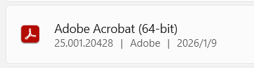
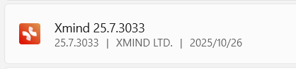
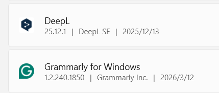

这份清单用于记录电脑中常用桌面软件及当时的安装版本，方便重装系统、迁移设备或排查兼容性问题。版本号来自原始笔记截图，仅代表记录时的本地环境。

## 绘图与文档

### Next AI Draw.io

用于绘制流程图、架构图和其他技术图示。截图中的版本为 **0.4.13**。

### Adobe Acrobat

用于查看、批注和处理 PDF 文档；本地安装的是 **64 位版本**。

### XMind

用于整理思维导图、知识结构和任务拆解。截图中的版本为 **25.7.3033**。

## 远程连接

### RealVNC Viewer

用于连接和管理远程桌面。截图中的版本为 **7.15.1**。

## 写作与语言工具

### DeepL 与 Grammarly

DeepL 用于翻译和文本润色，Grammarly for Windows 用于英文写作检查。截图中的 DeepL 版本为 **25.12.1**。

> [!NOTE]
>
> 软件版本会持续更新；重新安装时应以官方网站提供的当前稳定版本为准。
