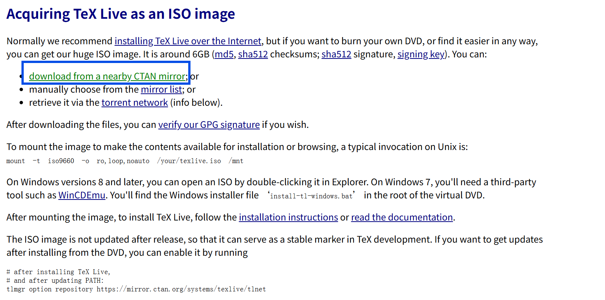
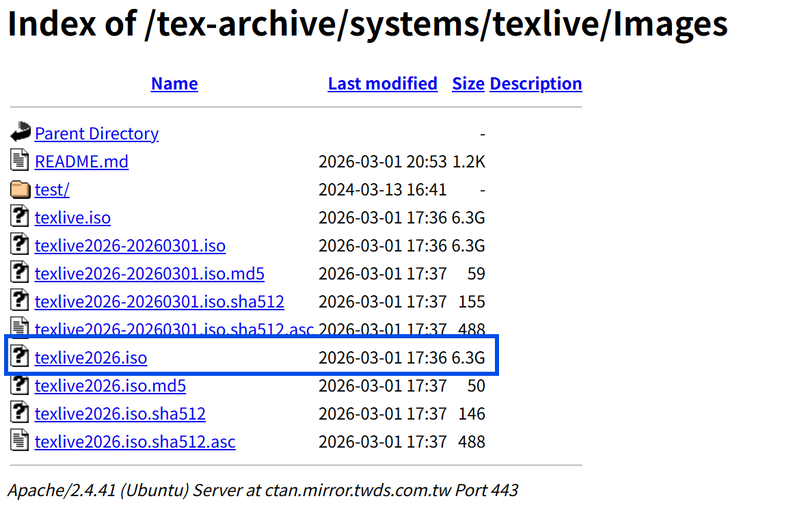
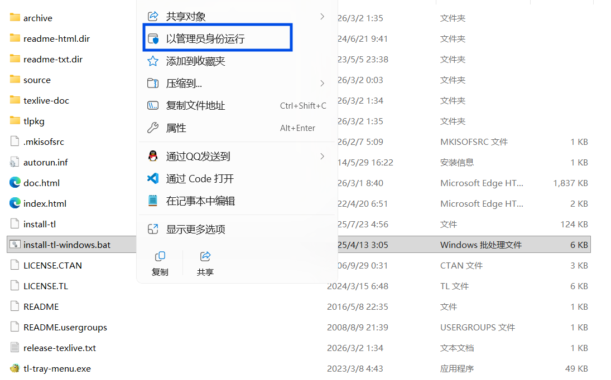
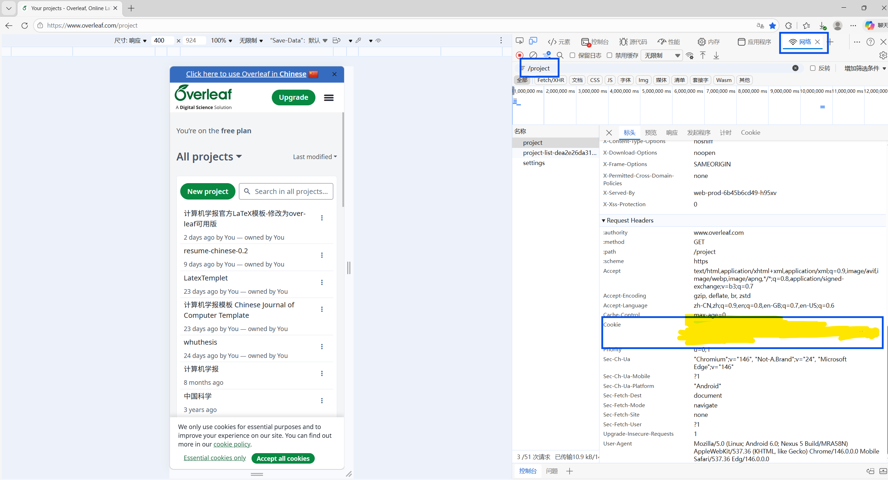

> 适用环境：Windows 11
> 编辑器：VS Code
> TeX 发行版：TeX Live 2026
> LaTeX 插件：LaTeX Workshop
> 适用场景：Overleaf 项目迁移到本地、在 VS Code 中进行高效编译与预览、解决中文模板编译问题

---

参考连接

- https://blog.csdn.net/weixin_57972634/article/details/148281818

- [[科研实践\] VS Code (Copilot) + Overleaf (使用 Overleaf Workshop 插件)_cursor overleaf-CSDN博客](https://blog.csdn.net/weixin_57972634/article/details/148281818)

- [Acquiring TeX Live as an ISO image - TeX Users Group](https://tug.org/texlive/acquire-iso.html)

## 1. 写在前面

我之前一直在 Overleaf 上在线写论文，优点是方便，不需要自己配置环境；缺点也很明显：

- 项目稍微大一点，编译速度变慢
- 网络不好时容易卡顿
- 一些模板和图片较多时体验一般
- 长期写论文时，本地编辑器的效率明显更高

因此，我决定把论文迁移到 **VS Code + LaTeX** 的本地方案上，实现：

- 本地快速编译
- VS Code 内联预览
- 保留 Overleaf 的项目结构
- 避免每次都依赖网页环境

这篇文档记录了我完整的踩坑过程、问题原因和最终可用方案。

---

## 2. 我的目标

最终目标不是“能装上 LaTeX 就行”，而是：

1. 在 Windows 11 上安装本地 LaTeX 环境
2. 在 VS Code 中正常编译 `.tex`
3. 兼容我从 Overleaf 同步下来的项目
4. 对中文模板、参考文献、图片等内容正常处理
5. 提高论文写作效率

---

## 3. 环境信息

本文采用的环境如下：

- 操作系统：Windows 11
- 编辑器：VS Code
- LaTeX 插件：LaTeX Workshop
- LaTeX 发行版：TeX Live 2026
- 本地项目目录示例：
  - `D:\Documents\code\latex\reid`
- 编译器：
  - `pdflatex`
  - `xelatex`
  - `latexmk`
  - `bibtex`
  - `biber`

---

## 4. 为什么不用纯 Overleaf

Overleaf 很适合轻量项目，但当论文进入正式写作阶段后，会遇到一些问题：

### 4.1 编译效率问题

项目变大后，在线编译不如本地快。

### 4.2 图片和资源管理不方便

本地文件夹管理图片、参考文献、模板文件更直观。

### 4.3 调试体验一般

本地 VS Code 能直接看日志、看错误、快速跳转，体验明显更好。

### 4.4 模板兼容问题

有些模板在 Overleaf 上能跑，不代表本地直接照搬就没问题。本地更方便逐步定位问题。

---

## 5. 第一步：安装 TeX Live

我最终选择的是 **TeX Live 2026**，

在镜像网站里下载iso文件：
网址：[Acquiring TeX Live as an ISO image](https://tug.org/texlive/acquire-iso.html)





以管理员身份运行



安装在：

```text
D:\texlive\2026
```

安装完成后，验证以下命令是否可用：

```powershell
pdflatex --version
xelatex --version
latexmk --version
tlmgr --version
```

如果都能正常输出版本号，说明 TeX Live 本体已经装好了。

### 5.1 验证结果示例

```powershell
pdflatex --version
xelatex --version
latexmk --version
tlmgr --version
```

都能正常显示版本，说明：

- LaTeX 核心编译器可用
- `latexmk` 可用
- `tlmgr` 可用
- 环境本身没问题

---

## 6. 第二步：安装 VS Code 插件

在 VS Code 中安装插件：

```text
LaTeX Workshop
```

这是 VS Code 里最常用的 LaTeX 插件，主要负责：

- 调用编译器
- 自动识别根文件
- 管理 recipe
- 打开 PDF 预览
- 支持 SyncTeX 跳转

---

## 7. 第三步：最开始遇到的问题

虽然命令行里 `xelatex`、`latexmk` 都可以运行，但在 VS Code 中却出现了下面这种报错：

```text
spawn xelatex ENOENT
spawn latexmk ENOENT
```

### 7.1 原因分析

这说明：

- TeX Live 已经装好了
- 但 **VS Code 进程没有拿到正确的 PATH**
- LaTeX Workshop 在自己的环境里找不到 `xelatex` / `latexmk`

### 7.2 为什么命令行可以、VS Code 不行

因为：

- PowerShell 是新的终端进程
- VS Code 可能是更早启动的
- 它继承的是旧环境变量
- 所以插件启动时看不到 TeX Live 的路径

### 7.3 解决办法

最稳的办法不是继续和 PATH 死磕，而是：

**直接在 LaTeX Workshop 配置里写绝对路径。**

这样无论 VS Code 的 PATH 有没有刷新，插件都能直接找到编译器。

---

## 8. 第四步：为什么 Overleaf Workshop 里不能直接本地编译

[Overleaf-workshop/Overleaf-Workshop：在 vscode 中开放 Overleaf/ShareLaTex 项目，提供全面协作支持。](https://github.com/overleaf-workshop/overleaf-workshop#how-to-login-with-cookies)



我后来还尝试过在 VS Code 中直接使用 Overleaf Workshop 打开的工程进行编译，结果出现问题。

日志中显示工作区是：

```text
overleaf-workshop://...
```

而不是正常的本地路径：

```text
file:///D:/...
```

### 8.1 本质原因

LaTeX Workshop 主要是为本地文件系统设计的。
而 Overleaf Workshop 打开的工程是一个“虚拟工作区”，不是普通磁盘目录，所以：

- 根文件识别不稳定
- 编译链可能接不上
- PDF 查看命令也可能失败

### 8.2 结论

如果要本地高效编译，**不要在 `overleaf-workshop://` 虚拟工程里强行编译**。

正确方式是：

1. 从 Overleaf 把项目同步或下载到本地目录
2. 用 VS Code 直接打开这个本地文件夹
3. 再用 LaTeX Workshop 编译

---

## 9. 第五步：从 Overleaf 迁移到本地时的一个核心问题——编译器不一致

这是我整个配置过程中最关键的坑之一。

### 9.1 现象

我本地一开始一直用 `XeLaTeX` 编译，但模板出现了大量中文缺字，例如：

```text
Missing character: There is no 第 in font ...
Missing character: There is no 计 in font ...
Missing character: There is no 算 in font ...
```

### 9.2 原因

因为我这个《计算机学报》模板在 Overleaf 上实际使用的是`pdfLaTeX`而不是 `XeLaTeX`。

### 9.3 为什么这会出问题

模板中使用了较传统的中文处理方案，比如：

- `CJKutf8`
- `times.sty`
- `zhwinfonts.tex`

这些内容的设计预期更接近 `pdfLaTeX` 的编译链。
如果强行换成 `XeLaTeX`，字体机制和驱动链就不一致，容易导致：

- 中文缺字
- 驱动警告
- 版式异常
- 包兼容问题

### 9.4 结论

**如果 Overleaf 上这个项目本来就是 `pdfLaTeX`，本地就尽量也用 `pdfLaTeX`。**

不要无脑切到 `XeLaTeX`。

---

## 10. 最终可用的 VS Code 配置

下面是我最终整理出来的 `settings.json` 中 LaTeX 相关可用配置。

### 10.1 推荐完整配置

```json
{
    "settingsSync.ignoredSettings": [
        "editor.fontSize"
    ],
    "cmake.showOptionsMovedNotification": false,
    "debug.onTaskErrors": "abort",
    "files.autoSave": "afterDelay",
    "makefile.configureOnOpen": true,
    "git.autofetch": true,
    "python.analysis.typeCheckingMode": "basic",
    "C_Cpp.default.compilerPath": "D:/mingw64/bin/gcc.exe",
    "remote.SSH.remotePlatform": {
        "服务器": "linux"
    },
    "git.confirmSync": false,
    "git.enableSmartCommit": true,
    "chatgpt.localeOverride": "zh-CN",
    "editor.fontSize": 20,

    "latex-workshop.latex.autoBuild.run": "onSave",
    "latex-workshop.view.pdf.viewer": "tab",
    "latex-workshop.synctex.afterBuild.enabled": true,

    "latex-workshop.latex.tools": [
        {
            "name": "pdflatex",
            "command": "D:/texlive/2026/bin/windows/pdflatex.exe",
            "args": [
                "-synctex=1",
                "-interaction=nonstopmode",
                "-file-line-error",
                "%DOC%"
            ]
        },
        {
            "name": "bibtex",
            "command": "D:/texlive/2026/bin/windows/bibtex.exe",
            "args": [
                "%DOCFILE%"
            ]
        },
        {
            "name": "latexmk_pdflatex",
            "command": "D:/texlive/2026/bin/windows/latexmk.exe",
            "args": [
                "-pdf",
                "-synctex=1",
                "-interaction=nonstopmode",
                "-file-line-error",
                "%DOC%"
            ]
        },
        {
            "name": "xelatex",
            "command": "D:/texlive/2026/bin/windows/xelatex.exe",
            "args": [
                "-synctex=1",
                "-interaction=nonstopmode",
                "-file-line-error",
                "%DOC%"
            ]
        },
        {
            "name": "biber",
            "command": "D:/texlive/2026/bin/windows/biber.exe",
            "args": [
                "%DOCFILE%"
            ]
        },
        {
            "name": "latexmk_xelatex",
            "command": "D:/texlive/2026/bin/windows/latexmk.exe",
            "args": [
                "-xelatex",
                "-synctex=1",
                "-interaction=nonstopmode",
                "-file-line-error",
                "%DOC%"
            ]
        }
    ],

    "latex-workshop.latex.recipes": [
        {
            "name": "pdflatex -> bibtex -> pdflatex*2",
            "tools": [
                "pdflatex",
                "bibtex",
                "pdflatex",
                "pdflatex"
            ]
        },
        {
            "name": "latexmk (pdflatex)",
            "tools": [
                "latexmk_pdflatex"
            ]
        },
        {
            "name": "xelatex -> biber -> xelatex*2",
            "tools": [
                "xelatex",
                "biber",
                "xelatex",
                "xelatex"
            ]
        },
        {
            "name": "latexmk (xelatex)",
            "tools": [
                "latexmk_xelatex"
            ]
        }
    ],

    "latex-workshop.latex.recipe.default": "lastUsed",

    "latex-workshop.latex.clean.fileTypes": [
        "*.aux",
        "*.bbl",
        "*.bcf",
        "*.blg",
        "*.idx",
        "*.ind",
        "*.lof",
        "*.lot",
        "*.out",
        "*.toc",
        "*.acn",
        "*.acr",
        "*.alg",
        "*.glg",
        "*.glo",
        "*.gls",
        "*.ist",
        "*.fls",
        "*.log",
        "*.fdb_latexmk",
        "*.synctex.gz",
        "*.run.xml",
        "*.xdv"
    ],

    "workbench.editorAssociations": {
        "*.copilotmd": "vscode.markdown.preview.editor",
        "*.pdf": "latex-workshop-pdf-hook"
    }
}
```

---

## 11. 这套配置为什么这样写

### 11.1 用绝对路径

为了绕开 VS Code 的 PATH 不一致问题。

### 11.2 同时保留 `pdflatex` 和 `xelatex`

因为不同模板可能需要不同引擎：

- 传统中文模板：常常适合 `pdflatex`
- 现代中文模板：通常更适合 `xelatex`

### 11.3 用 `latexmk`

`latexmk` 比手动多次跑编译器更稳：

- 能自动多轮编译
- 更接近 Overleaf 生产环境
- 对参考文献、交叉引用更友好

### 11.4 保留 `bibtex` 和 `biber`

因为不同模板用的参考文献系统不同：

- `bibtex`：传统方案
- `biber`：`biblatex` 方案

---

## 12. 最终编译方式怎么选

### 12.1 对我这个《计算机学报》模板

优先使用：

```text
latexmk (pdflatex)
```

### 12.2 如果模板明确使用 bibtex

可以用：

```text
pdflatex -> bibtex -> pdflatex*2
```

### 12.3 如果是现代中文模板（如 xeCJK 体系）

可以改用：

```text
latexmk (xelatex)
```

---

## 13. 如何切换编译 recipe

在 VS Code 中：

1. 按 `Ctrl + Shift + P`

2. 输入：

   ```text
   LaTeX Workshop: Build with recipe
   ```

3. 选择需要的 recipe

例如：

- `latexmk (pdflatex)`
- `pdflatex -> bibtex -> pdflatex*2`
- `latexmk (xelatex)`

---

## 14. 为什么我之前会遇到 `biber` 报错

我之前在一个很简单的测试文件里使用了：

```text
xelatex -> biber -> xelatex*2
```

但那个文件并没有使用 `biblatex`，因此不会生成 `.bcf` 文件。

于是 `biber` 报错：

```text
ERROR - Cannot find 'mian.bcf'!
```

### 14.1 这说明什么

不是 `biber` 坏了，而是：

**文档类型和 recipe 不匹配。**

### 14.2 正确理解

只有当文档中用了：

```tex
\usepackage[backend=biber]{biblatex}
\addbibresource{xxx.bib}
```

时，才应该使用 `biber`。

---

## 15. 为什么有时“查看 PDF”会失败

我后来还遇到过下面这种日志：

```text
Active document is not a TeX file.
```

### 15.1 原因

执行“查看 PDF”命令时，当前焦点不在 `.tex` 文件上，而是在：

- 输出面板
- 设置文件
- PDF 页本身
- 其他非 TeX 文件

LaTeX Workshop 需要知道“当前 TeX 文件对应哪个 PDF”，所以如果当前激活文档不是 `.tex`，它就无法定位。

### 15.2 正确做法

先点回主文件，例如：

```text
CjC_template_tex.tex
```

然后再执行：

- `LaTeX Workshop: View LaTeX PDF`
- 或快捷键打开 PDF

---

## 16. 本地项目结构建议

建议本地项目目录保持清晰，例如：

```text
reid/
├── CjC_template_tex.tex
├── CjC.cls
├── captionhack.sty
├── picins.sty
├── figures/
│   ├── 2.png
│   ├── 3.png
│   ├── 4.png
│   └── ...
├── simkai.ttf
├── simhei.ttf
├── simfang.ttf
├── simsun.ttc
└── ...
```

这样做的好处是：

- 模板文件完整
- 字体资源可控
- 图片路径清晰
- 本地和 Overleaf 更容易同步

---

## 17. 我整个过程踩过的主要坑

### 17.1 命令行能用，VS Code 不能用

原因：VS Code 的 PATH 没刷新。
解决：直接写绝对路径。

### 17.2 在 Overleaf Workshop 的虚拟工程里想直接本地编译

原因：`overleaf-workshop://` 不是普通本地文件系统路径。
解决：项目落地到本地文件夹再编译。

### 17.3 模板在 Overleaf 用 `pdfLaTeX`，本地却误用 `XeLaTeX`

结果：大量中文缺字。
解决：本地与 Overleaf 使用同一编译器。

### 17.4 文档不需要 `biber`，却强行使用 `biber` recipe

结果：报 `.bcf` 文件不存在。
解决：根据模板和文档实际情况选择 recipe。

### 17.5 查看 PDF 时当前焦点不是 `.tex`

结果：LaTeX Workshop 提示当前活动文档不是 TeX 文件。
解决：先切回主 `.tex` 文件。

---

## 18. 最终推荐工作流

对于我现在这个项目，我推荐的日常工作流如下：

### 18.1 第一次打开项目

- 用 VS Code 打开本地文件夹
- 确认主文件是 `CjC_template_tex.tex`

### 18.2 选择编译链

使用：

```text
latexmk (pdflatex)
```

### 18.3 写作过程

- 直接编辑 `.tex`
- 保存自动编译
- 在 VS Code 中预览 PDF

### 18.4 出现问题时优先排查

按顺序排查：

1. 当前是不是本地项目，而不是 Overleaf 虚拟工程
2. 当前活动文件是不是 `.tex`
3. recipe 是否选对
4. 模板要求的是 `pdflatex` 还是 `xelatex`
5. 是否误用了 `bibtex/biber`

---

## 19. 我的最终结论

要在 **VS Code + LaTeX** 中实现 **Overleaf 本地高效编译**，关键不是单纯把 TeX Live 装上，而是要把以下几件事做对：

1. **用本地文件夹打开项目，不要依赖 `overleaf-workshop://` 虚拟工程做本地编译**
2. **LaTeX Workshop 中尽量使用绝对路径调用编译器**
3. **本地编译器与 Overleaf 上使用的编译器保持一致**
4. **根据模板实际情况选择 `pdflatex / xelatex / bibtex / biber`**
5. **优先使用 `latexmk` 提高稳定性和效率**

对于我这个《计算机学报》模板来说，最合适的方案就是：

```text
latexmk (pdflatex)
```

这也是目前本地最稳定、最接近 Overleaf 行为的方式。

---

## 20. 后续可继续优化的方向

后面如果继续完善，可以再做这些事：

- 增加主文件魔法注释 `% !TeX root = ...`
- 给不同模板单独配置 `.vscode/settings.json`
- 整理参考文献工作流
- 整理图片、表格、公式的插入规范
- 写一个专门的“论文模板迁移清单”

---

## 21. 一句话总结

> 想在 VS Code 中高效替代 Overleaf，核心不是“装上 LaTeX”，而是“让本地编译器、项目目录、模板编译链、VS Code 配置四者完全对齐”。

```
如果你愿意，我下一步可以继续帮你把这篇文档再升级成更像博客文章的版本，比如加上“问题-原因-解决”小节、命令行块、注意事项和目录锚点。
```
