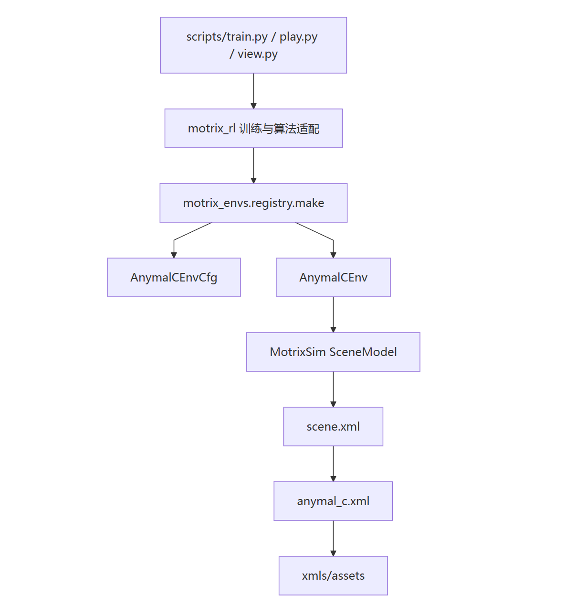
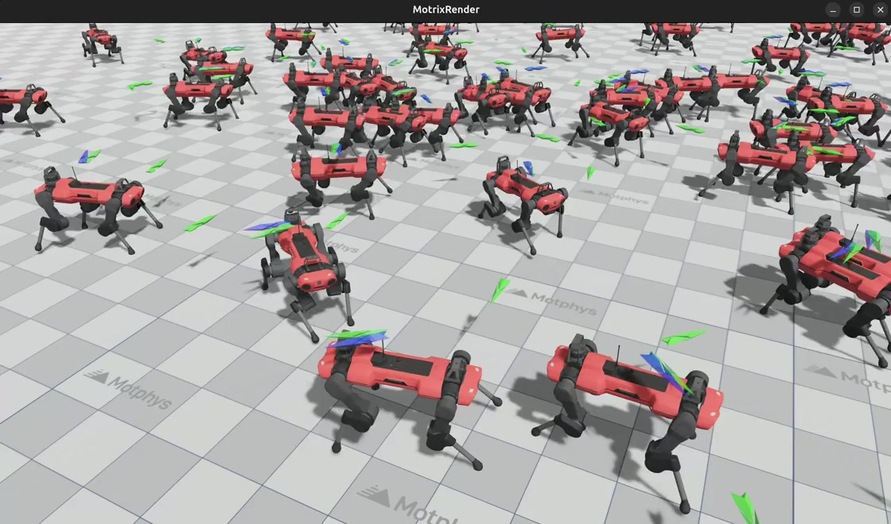

# 第 3 周周报：搭建与配置 ANYmal C 环境

|项目|内容|
|---|---|
|周次|第 3 周|
|任务对象|ANYbotics ANYmal C 四足机器人导航环境|
|环境注册名|anymal\_c\_navigation\_flat|
|仿真后端|MotrixSim NumPy 后端（np）|
|本周状态|环境结构、资产、XML、配置、运行闭环与空间定义均已核验|
|训练状态|训练命令已保留，本周未执行训练|

> **交付结论：** 本周已完成原始任务要求中的目录搭建核验、ANYmal C 资产引入核验、XML 原理学习、配置类分析、环境核心闭环分析、MotrixRender 环境截图以及 Observation/Action Space 明细。根据用户要求，原任务中的 PDF 周报改为本 Markdown 文档。
>
>

## 本周目标与完成情况

本周目标是理解 MotrixLab 如何组织 MuJoCo 风格 XML 机器人模型，并完成一个可被注册、加载、步进和训练框架调用的 ANYmal C 强化学习环境。

仓库已包含完整的 ANYmal C 实现。本周工作以现有实现为对象，完成了以下内容：

1. 核对 ANYmal C 环境目录、注册入口和模块职责。

2. 拆解 XML 中 Body、Joint、Geom、Site、Sensor 和 Actuator 的作用。

3. 分析基于 dataclass 的配置组织方式。

4. 梳理动作应用、状态更新、奖励、终止和重置的完整闭环。

5. 实例化 4 个并行环境并执行非训练零动作步进验证。

6. 核验观测空间、动作空间、模型自由度和执行器数量。

7. 整理环境截图、训练命令、已知问题和后续改进方向。

## 任务要求与仓库实现映射

任务说明建议建立 navigation/anymal\_c/ 目录。MotrixLab 实际按照环境类型组织代码，因此本项目采用仓库原有规范路径：

```Plain Text
motrix_envs/src/motrix_envs/locomotion/anymal_c/
├── __init__.py
├── cfg.py
├── anymal_c_np.py
└── xmls/
    ├── scene.xml
    ├── anymal_c.xml
    └── assets/
```

没有额外创建重复的 navigation/anymal\_c/，以避免出现两套注册入口、配置和资产。任务要求与实际文件的对应关系如下：

|任务建议文件|仓库实际文件|完成情况|
|---|---|---|
|\_\_init\_\_\.py|[locomotion/anymal\_c/\_\_init\_\_\.py](https://my.feishu.cn/wiki/motrix_envs/src/motrix_envs/locomotion/anymal_c/__init__.py)|已完成，导入配置与环境实现并触发注册|
|cfg\.py|[locomotion/anymal\_c/cfg\.py](https://my.feishu.cn/wiki/motrix_envs/src/motrix_envs/locomotion/anymal_c/cfg.py)|已完成，定义环境与嵌套配置|
|env\.py|[locomotion/anymal\_c/anymal\_c\_np\.py](https://my.feishu.cn/wiki/motrix_envs/src/motrix_envs/locomotion/anymal_c/anymal_c_np.py)|已完成，明确标识 NumPy 后端|
|xmls/|[locomotion/anymal\_c/xmls/](https://my.feishu.cn/wiki/motrix_envs/src/motrix_envs/locomotion/anymal_c/xmls/)|已完成，包含场景、机器人模型与资产|

环境注册链路：

```Plain Text
导入 motrix_envs
-> anymal_c/__init__.py
-> @registry.envcfg("anymal_c_navigation_flat")
-> @registry.env("anymal_c_navigation_flat", "np")
-> registry.make(...)
```

### 2\.1 初步代码框架核验

配置类通过注册装饰器挂载到环境名，并使用 field\(default\_factory=\.\.\.\) 创建独立的嵌套配置：

```Plain Text
@registry.envcfg("anymal_c_navigation_flat")
@dataclass
class AnymalCEnvCfg(EnvCfg):
    model_file: str = model_file
    sim_dt: float = 0.01
    ctrl_dt: float = 0.01
    control_config: ControlConfig = field(default_factory=ControlConfig)
```

环境实现注册到 np 后端，并提供核心状态转移方法：

```Plain Text
@registry.env("anymal_c_navigation_flat", "np")
class AnymalCEnv(NpEnv):
    def apply_action(self, actions, state): ...
    def update_state(self, state): ...
    def _compute_reward(self, data, info, velocity_commands): ...
    def _compute_terminated(self, state): ...
    def reset(self, data): ...
```

MotrixLab 使用 update\_state\(\) 汇总观测、奖励和终止计算，因此它承担了任务要求中 \_compute\_observation\(\) 的职责；终止检查方法则命名为 \_compute\_terminated\(\)。

## 系统架构与职责划分




```Plain Text
flowchart TD
    A[scripts/train.py / play.py / view.py] --> B[motrix_rl 训练与算法适配]
    B --> C[motrix_envs.registry.make]
    C --> D[AnymalCEnvCfg]
    C --> E[AnymalCEnv]
    E --> F[MotrixSim SceneModel]
    F --> G[scene.xml]
    G --> H[anymal_c.xml]
    H --> I[xmls/assets]
```

|层级|职责|
|---|---|
|scripts|提供训练、回放、查看和 benchmark 的统一入口|
|motrix\_rl|对接 SKRL、RSL\-RL 等强化学习框架|
|motrix\_envs|定义任务状态转移、注册机制和环境接口|
|MotrixSim|加载模型、推进物理仿真和维护并行场景|
|XML 与资产|描述机器人结构、碰撞、执行器、传感器和场景|

该分层使环境逻辑不依赖具体强化学习算法，同一环境可以由不同训练框架复用。

## 模型资产与来源核验

### 4\.1 本地资产统计

对 xmls/ 目录进行核验后，得到以下结果：

|项目|数量|
|---|---|
|资产文件总数|45|
|OBJ 网格|25|
|PNG 纹理|19|
|STL 网格|1|

当前模型结构与 Google DeepMind MuJoCo Menagerie 中的 anybotics\_anymal\_c 模型高度对应。官方模型目录标注该机器人由 ANYbotics 提供，具有 12 个主动自由度，并采用 BSD\-3\-Clause 许可。

参考链接：

- [MuJoCo Menagerie](https://github.com/google-deepmind/mujoco_menagerie)

- [MuJoCo Menagerie ANYmal C 模型](https://github.com/google-deepmind/mujoco_menagerie/tree/main/anybotics_anymal_c)

### 4\.2 资产许可风险

本地 anymal\_c/xmls/ 目录中未发现模型专属的 LICENSE 或 [README\.md](http://README.md)。因此，仅凭本地仓库无法完整证明资产来源及再分发许可。

在内部学习与验证阶段可以继续使用；若后续需要公开发布、提交到外部仓库或用于商业分发，应补充原始模型的许可文件和来源说明，并再次核对网格与纹理文件的许可条件。

## XML 模型机制拆解

### 5\.1 场景与机器人模型分离

scene\.xml 是仿真入口，负责引入 anymal\_c\.xml 并添加平面地面、材质、天空盒、灯光和默认相机。anymal\_c\.xml 专注描述机器人本体。

这种拆分方式可以在不修改机器人模型的情况下，将 ANYmal C 放入不同地形或任务场景。

### 5\.2 XML 结构统计

|XML 元素|数量|作用|
|---|---|---|
|body|16|构成基座和四条腿的刚体树|
|joint|13|包含根自由关节和腿部关节定义|
|主动关节|12|每条腿包含 HAA、HFE、KFE 三个关节|
|geom|101|定义视觉网格和碰撞几何|
|site|1|定义基座 IMU 位置|
|实际位置执行器|12|控制 12 个主动关节|
|实际传感器|2|获取基座线速度和角速度|

XML 中共有 13 个 \<position\> 标签，其中 1 个是默认模板，12 个是实际关节执行器。

### 5\.3 Body 与 Joint

ANYmal C 的根刚体为 base，包含自由关节，因此机器人能够在三维空间平移和旋转。四条腿以树状结构连接到基座：

```Plain Text
base
├── LF_HIP -> LF_THIGH -> LF_SHANK -> LF_FOOT
├── RF_HIP -> RF_THIGH -> RF_SHANK -> RF_FOOT
├── LH_HIP -> LH_THIGH -> LH_SHANK -> LH_FOOT
└── RH_HIP -> RH_THIGH -> RH_SHANK -> RH_FOOT
```

每条腿包含 HAA、HFE 和 KFE 三个铰链关节。模型自由度如下：

|指标|数值|
|---|---|
|广义位置维度 nq|19|
|广义速度维度 nv|18|
|主动关节数|12|

### 5\.4 Geom、Site 与 Sensor

视觉几何与碰撞几何在 XML 中分离：

- visual 类负责显示网格，不参与接触计算。

- collision 类负责物理碰撞。

- 四个足端使用球形接触几何并配置摩擦。

- 基座碰到地面时会触发任务终止。

基座内定义了 imu\_site，并注册两个实际传感器：

|传感器|类型|用途|
|---|---|---|
|base\_linvel|framelinvel|获取基座线速度|
|base\_gyro|gyro|获取本体角速度|

投影重力不直接来自传感器，而是根据根姿态四元数计算，用于描述机器人倾斜状态。

### 5\.5 Actuator

12 个主动关节分别由位置执行器控制。默认执行器参数如下：

|参数|数值|
|---|---|
|kp|200|
|kv|1|
|控制范围|\[\-6\.28, 6\.28\]|
|力矩范围|\[\-140, 140\] N·m|

策略动作先被限制在 \[\-1, 1\]，再乘以 action\_scale = 0\.06，最后叠加到默认站姿关节角并写入执行器控制量。

### 5\.6 Robot Viewer 辅助检查

原始任务推荐使用 [Robot Viewer](https://viewer.robotsfan.com/) 在线查看 \.urdf 或 \.obj 模型。它适合在资产接入前快速检查网格朝向、比例和层级，但不能替代 MotrixLab 中的场景加载与物理碰撞验证。

本项目最终以 MotrixRender 加载 scene\.xml 的结果作为验收依据，因为该过程同时覆盖机器人模型、纹理、碰撞体、地面、执行器和任务标记。Robot Viewer 可作为单个 OBJ 网格异常时的辅助排查工具。

## 配置类设计

环境使用 Python dataclass 和 field\(default\_factory=\.\.\.\) 管理嵌套配置：

```Plain Text
AnymalCEnvCfg
├── NoiseConfig
├── ControlConfig
├── RewardConfig
├── InitState
├── Commands
├── Normalization
├── Asset
└── Sensor
```

field\(default\_factory=\.\.\.\) 可以确保每次创建环境配置时获得独立的嵌套对象，避免多个环境实例共享可变默认值。

关键参数：

|参数|当前值|含义|
|---|---|---|
|model\_file|xmls/scene\.xml|场景入口|
|sim\_dt|0\.01 s|物理仿真步长|
|ctrl\_dt|0\.01 s|控制步长|
|max\_episode\_seconds|7\.0 s|最大回合时长|
|max\_episode\_steps|700|最大控制步数|
|max\_dof\_vel|100 rad/s|关节速度终止阈值|

## 环境核心闭环

任务要求中的核心方法与 MotrixLab 实际实现对应如下：

|任务要求|实际实现|作用|
|---|---|---|
|apply\_action\(\)|apply\_action\(\)|保存历史动作并写入 12 个目标关节角|
|\_compute\_observation\(\)|update\_state\(\) 中完成|读取物理状态并拼接观测|
|\_compute\_reward\(\)|\_compute\_reward\(\)|计算导航、停止及运动惩罚奖励|
|\_check\_termination\(\)|\_compute\_terminated\(\)|检测速度异常、基座触地和侧翻|
|reset\(\)|reset\(\)|随机生成出生点和目标，并恢复站姿|

MotrixLab 基类 NpEnv\.step\(\) 的执行顺序为：

```Plain Text
清空上一步 reward/done
-> apply_action()
-> physics_step()
-> update_state()
-> steps += 1
-> 计算时间截断
-> 自动重置完成的子环境
```

update\_state\(\) 是该实现中的状态汇总入口，它依次读取仿真状态、更新导航命令、计算观测、奖励和终止条件。

## 观测空间与动作空间

### 8\.1 动作空间

```Plain Text
Box(-1.0, 1.0, (12,), float32)
```

动作与四条腿的 12 个主动关节一一对应：

```Plain Text
LF_HAA, LF_HFE, LF_KFE,
RF_HAA, RF_HFE, RF_KFE,
LH_HAA, LH_HFE, LH_KFE,
RH_HAA, RH_HFE, RH_KFE
```

### 8\.2 观测空间

```Plain Text
Box(-inf, inf, (54,), float32)
```

|观测组成|维度|
|---|---|
|基座线速度|3|
|基座角速度|3|
|投影重力|3|
|相对关节角|12|
|关节速度|12|
|历史动作|12|
|速度命令|3|
|位置误差|2|
|朝向误差|1|
|距离|1|
|到达标志|1|
|停止就绪标志|1|
|**合计**|**54**|

该观测同时包含机器人本体状态、历史控制信息和导航目标信息，能够支持策略学习移动到目标点并停止。

## 非训练环境验证

为避免把训练结果与环境正确性混淆，本周仅执行环境加载和零动作步进验证，没有运行训练。

验证配置：

```Plain Text
环境：anymal_c_navigation_flat
后端：np
并行环境数：4
动作：全零动作
步进次数：10
```

实际结果：

```Plain Text
注册信息：{'config_class': 'AnymalCEnvCfg', 'available_backends': ['np']}
模型入口：motrix_envs/src/motrix_envs/locomotion/anymal_c/xmls/scene.xml
观测空间：Box(-inf, inf, (54,), float32)
动作空间：Box(-1.0, 1.0, (12,), float32)
模型 nq / nv：19 / 18
执行器数量：12
第 10 步观测形状：(4, 54)
观测均为有限值：True
第 10 步平均奖励：-0.955173
累计异常终止数：0
累计超时截断数：0
各环境步数：[10, 10, 10, 10]
```

验证结果说明：

- 注册器能够找到配置类和 NumPy 环境实现。

- XML 场景、网格和纹理资产能够被正确加载。

- 观测和动作维度与代码定义一致。

- 4 个并行环境可以连续步进，观测中未出现 NaN 或无穷值。

- 10 步内未发生异常终止；该验证只证明最小运行闭环可用，不代表策略已经训练完成。

## 环境截图与查看命令

下图为仓库已有 ANYmal C 环境展示图的本地交付副本。截图窗口标题为 MotrixRender；画面中机器人模型、地面和导航标记均能正常显示，未见明显的模型穿透、资产缺失或加载报错。




本地查看环境命令：

```Plain Text
uv run scripts/view.py --env anymal_c_navigation_flat --num-envs 1
```

可选的非训练性能测试命令：

```Plain Text
uv run scripts/bench.py --env anymal_c_navigation_flat --num_envs 256 --num_steps 1000
```

以上命令用于查看或 benchmark，不会执行策略训练。

## 训练命令（保留，未执行）

按照任务要求保留训练命令，由使用者自行执行。本周报告没有运行以下命令，也没有将环境加载结果表述为训练结果。

SKRL \+ Torch：

```Plain Text
uv run scripts/train.py --env anymal_c_navigation_flat --rllib skrl --train-backend torch
```

RSL\-RL：

```Plain Text
uv run scripts/train.py --env anymal_c_navigation_flat --rllib rslrl --num-envs 2048 --seed 42
```

训练前建议先执行单环境查看命令，确认显卡驱动、资产加载和机器人初始姿态正常，再根据设备显存调整并行环境数。

## 实现检查与已知问题

|优先级|问题|影响与建议|
|---|---|---|
|高|本地 ANYmal C 资产目录缺少模型专属 LICENSE 和 README\.md|外部分发前应补齐资产来源和许可说明|
|中|reset\(\) 中位置到达阈值为 0\.1 m，正常 step 和 reward 使用 0\.3 m|初始化观测与后续观测语义不一致，建议统一阈值|
|中|NoiseConfig、reset\_noise\_scale 和 reset\_yaw\_scale 已配置但未实际使用|随机化和鲁棒性训练能力尚未接入|
|中|RewardConfig\.scales 已定义，但 \_compute\_reward\(\) 使用硬编码权重|调参需要改代码，建议统一读取配置|
|中|缺少 ANYmal C 专项测试|建议增加空间维度、奖励、终止、重置和长步进测试|

## 验收清单

|原始任务要求|状态|交付证据|
|---|---|---|
|创建 navigation/anymal\_c/ 及初步模块|通过|采用仓库规范路径 locomotion/anymal\_c/；第 2 节给出映射与可点击源码|
|从 mujoco\_menagerie 获取 ANYmal C 官方模型文件|通过并标注风险|第 4 节核验 45 个资产文件，并说明本地缺少模型专属许可文件|
|学习 Body、Site、Geom、Joint、Actuator|通过|第 5 节给出定义、数量、模型实例和控制关系|
|使用 Robot Viewer 辅助查看模型|已说明|第 5\.6 节给出工具链接、用途和与 MotrixRender 的区别|
|使用 dataclasses 与 field\(default\_factory=\.\.\.\) 编写配置|通过|第 2\.1、6 节及 cfg\.py 源码|
|实现环境核心闭环方法|通过|第 2\.1、7 节及 anymal\_c\_np\.py 源码|
|提交包含上述框架的初步代码文件|通过|第 2 节代码提交清单|
|提交无明显穿模和报错的环境截图|通过|第 10 节及 第三周\-ANYmal\-C环境截图\.jpg|
|列出 Observation Space 与 Action Space 维度明细|通过|第 8 节：54 维观测、12 维动作|
|输出周报文档|通过|按用户要求输出本 Markdown 文档，而非 PDF|

## 本周结论

ANYmal C 环境已经形成完整的“XML 资产 \-\> 配置类 \-\> 环境实现 \-\> 注册系统 \-\> 强化学习适配”链路。非训练验证表明，环境可以正确注册、加载模型、创建 4 个并行实例，并以 54 维观测和 12 维动作连续步进。

本周已达到“搭建与配置最小可运行 ANYmal C 环境”的目标。下一阶段应在完成训练后补充奖励曲线、成功率、回放效果和关键超参数，并优先解决资产许可说明、阈值不一致、配置未生效和专项测试缺失问题。
