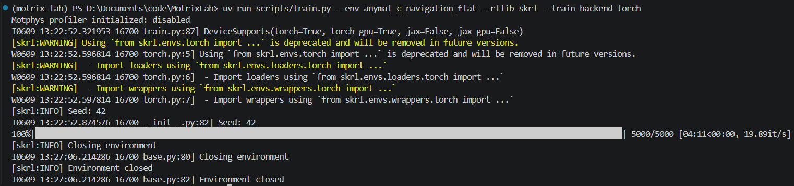
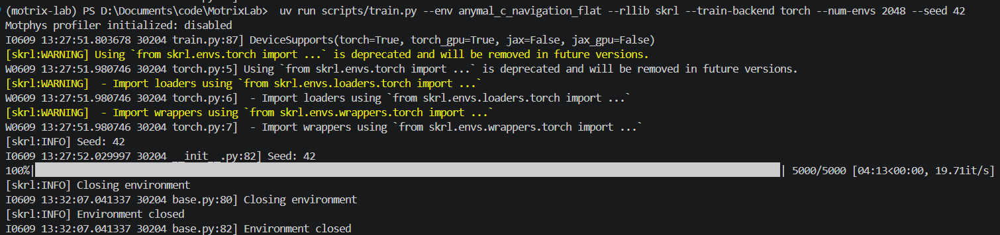
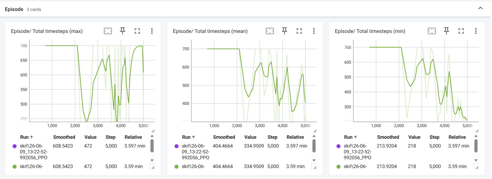

# 第 2 周：深入拆解 Locomotion 任务机制

|项目|内容|
|---|---|
|实验对象|anymal\_c\_navigation\_flat|
|仿真后端|MotrixSim NumPy \(np\)|
|强化学习算法|PPO|
|训练框架|SKRL、RSL\-RL|
|交付状态|已完成|

## 本周目标

本周以 anymal\_c\_navigation\_flat 为对象，从强化学习的黑盒视角拆解 ANYmal C 四足机器人导航任务，回答三个核心问题：

1. 机器人能“看到”什么？

2. 策略网络输出的动作具体控制什么？

3. 奖励函数如何把“走到目标并停稳”转化为可优化的数值信号？

相关实现：

- 环境配置：motrix\_envs/src/motrix\_envs/locomotion/anymal\_c/[cfg\.py](http://cfg.py)

- 环境逻辑：motrix\_envs/src/motrix\_envs/locomotion/anymal\_c/[anymal\_c\_np\.py](http://anymal_c_np.py)

- 机器人模型：motrix\_envs/src/motrix\_envs/locomotion/anymal\_c/xmls/anymal\_c\.xml

- PPO 配置：motrix\_rl/src/motrix\_rl/tasks/[anymal\_navigation\.py](http://anymal_navigation.py)

### 1\.1 本周交付摘要

本周完成了 ANYmal C 导航任务的机制拆解、参数对照实验和 PPO 训练验证：

- 明确了 54 维观测、12 维动作和分阶段奖励函数的物理意义。

- 验证了出生点随机化与目标范围配置的实际效果。

- 发现 NoiseConfig 当前尚未接入观测，修改噪声等级不会改变输入数据。

- 完成两次相同配置的 SKRL 5000\-step 训练，两次 TensorBoard 曲线完全一致。

- 完成一次 RSL\-RL 1017 iteration 训练，总计约 1 亿条环境 transition。

训练结果表明框架链路可以稳定运行，且奖励出现明显提升；但当前日志缺少任务成功率、最终距离和跌倒率，因此不能仅凭 reward 宣称导航任务已经完全解决。

## 认识 ANYmal C 本体

ANYmal C 具有四条腿，每条腿包含三个主动关节，共 12 个执行器。

|腿|HAA|HFE|KFE|
|---|---|---|---|
|左前 LF|LF\_HAA|LF\_HFE|LF\_KFE|
|右前 RF|RF\_HAA|RF\_HFE|RF\_KFE|
|左后 LH|LH\_HAA|LH\_HFE|LH\_KFE|
|右后 RH|RH\_HAA|RH\_HFE|RH\_KFE|

- HAA：髋关节外展/内收，主要控制腿向身体侧方摆动。

- HFE：髋关节屈伸，主要控制大腿前后摆动。

- KFE：膝关节屈伸，主要控制小腿折叠和伸展。

模型共有 19 个位置自由度、18 个速度自由度。其中浮动基座使用 7 个位置量和 6 个速度量，四条腿提供 12 个关节位置和 12 个关节速度。真正由策略直接控制的是 12 个腿部执行器。

### 2\.1 默认站立姿态

InitState\.default\_joint\_angles 定义默认站姿：

|关节组|前腿|后腿|
|---|---|---|
|HAA|0\.0 rad|0\.0 rad|
|HFE|0\.4 rad|\-0\.4 rad|
|KFE|\-0\.8 rad|0\.8 rad|

前后腿的 HFE、KFE 符号相反，是由机器人关节安装方向和坐标系定义造成的，并不表示前后腿采取相反的站立意图。

## 强化学习三要素

### 3\.1 观测：机器人能感知什么

环境观测空间为：

```Plain Text
Box(-inf, inf, (54,), float32)
```

54 维观测按以下顺序拼接：

|范围|维度|内容|缩放|
|---|---|---|---|
|0\-2|3|基座线速度|lin\_vel = 2\.0|
|3\-5|3|基座陀螺仪角速度|ang\_vel = 0\.25|
|6\-8|3|本体坐标系下的投影重力|无额外缩放|
|9\-20|12|相对默认站姿的关节角|dof\_pos = 1\.0|
|21\-32|12|关节速度|dof\_vel = 0\.05|
|33\-44|12|当前/上一控制周期动作|无额外缩放|
|45\-47|3|期望 XY 速度和期望 yaw 角速度|命令缩放|
|48\-49|2|到目标的位置误差|除以 5|
|50|1|朝向误差|除以 π|
|51|1|到目标的距离|除以 5 后截断到 \[0, 1\]|
|52|1|是否到达位置和朝向目标|0 或 1|
|53|1|是否到达且 yaw 角速度足够小|0 或 1|

其中投影重力非常重要。它让策略在不直接读取欧拉角的情况下判断机器人是否倾斜或侧翻。

### 3\.2 动作：策略网络输出什么

动作空间为：

```Plain Text
Box(-1.0, 1.0, (12,), float32)
```

策略输出不是电机力矩，而是相对默认站姿的目标关节角偏移。实际控制公式为：

```Plain Text
目标关节角 = 默认关节角 + 动作 × action_scale
```

当前 action\_scale = 0\.06，因此单维动作 1\.0 表示在默认角度基础上增加 0\.06 rad，约为 3\.44°。

XML 中使用位置执行器完成底层闭环控制：

```Plain Text
kp = 200
kv = 1
force range = [-140, 140] N·m
```

这种分层控制有三个好处：

1. 策略只需学习步态和目标关节姿态，不必同时学习底层电机稳定控制。

2. 位置目标比直接输出力矩更平滑，训练初期更不容易数值发散。

3. 动作范围统一为 \[\-1, 1\]，有利于 PPO 的策略分布建模。

### 3\.3 奖励：如何给行为打分

任务的奖励逻辑分为“未到达目标”和“已到达目标”两种状态。

#### 未到达目标

主要正奖励：

- 线速度跟踪：1\.5 × exp\(\-线速度误差² / 0\.25\)

- yaw 角速度跟踪：0\.3 × exp\(\-角速度误差² / 0\.25\)

- 接近目标：历史最小距离减去当前距离，再乘 4 并截断到 \[\-1, 1\]

主要惩罚：

- Z 方向线速度：抑制上下弹跳。

- XY 方向角速度：抑制翻滚和俯仰晃动。

- 执行器控制量平方：抑制过大控制输入。

- 动作变化率：抑制动作抖动。

- 跌倒、侧翻或关节速度异常：额外 \-20。

#### 已到达目标

到达条件：

- 位置距离小于 0\.3 m

- 朝向误差小于 15°

到达后不再继续鼓励前进，而是切换为停止奖励：

- 首次到达奖励：10

- 低平面速度奖励

- 低 yaw 角速度奖励

- 到达且 \|yaw rate\| \< 0\.05 rad/s 时额外奖励 6

这个切换非常关键。如果到达后仍持续奖励速度跟踪，机器人可能会穿过目标点，无法学会停稳。

## 为什么需要随机化与噪声

### 4\.1 域随机化

默认出生点随机范围为：

```Plain Text
x, y ∈ [-10, 10] m
```

目标点是在机器人出生位置基础上采样偏移：

```Plain Text
dx, dy ∈ [-5, 5] m
yaw ∈ [-3.14, 3.14] rad
```

出生位置随机化避免策略记住某个固定世界坐标。目标偏移随机化避免策略只学会单一方向或单一距离的运动。

### 4\.2 传感器噪声

配置中定义了：

|噪声项|默认尺度|
|---|---|
|关节角|0\.03|
|关节速度|1\.5|
|陀螺仪|0\.2|
|投影重力|0\.05|
|线速度|0\.1|
|总体等级|1\.0|

理论上，噪声能防止策略过度依赖仿真中的完美传感器数据，提高部署到真实机器人时的鲁棒性。

但是当前 ANYmal C 环境仅定义了 NoiseConfig，reset\(\) 和 update\_state\(\) 尚未将这些噪声真正加入观测。该问题已通过对照实验确认，见下节。

## 修改与对照实验

实验使用固定随机种子。采样类实验使用 2048 或 4096 个并行环境；步进类实验使用零动作执行完整 700 步回合。所有实验均直接基于 AnymalCEnvCfg 与 AnymalCEnv，不修改仓库代码。

### 5\.0 实验复现方式

可用以下模式复现实验：

```Plain Text
import numpy as np
from motrix_envs.locomotion.anymal_c.cfg import AnymalCEnvCfg
from motrix_envs.locomotion.anymal_c.anymal_c_np import AnymalCEnv

np.random.seed(20260608)
cfg = AnymalCEnvCfg()
env = AnymalCEnv(cfg, num_envs=8)
state = env.init_state()
```

需要注意：AnymalCEnv 是底层环境类，适合用于机制验证；正式训练入口仍是 scripts/[train\.py](http://train.py)。

### 5\.1 出生点范围实验

|配置|实际采样到的 X/Y 范围|目标偏移平均距离|
|---|---|---|
|默认 \[\-10, \-10, 10, 10\]|约 \[\-10, 10\]|3\.844 m|
|极小 \[\-0\.1, \-0\.1, 0\.1, 0\.1\]|约 \[\-0\.1, 0\.1\]|3\.844 m|
|极大 \[\-50, \-50, 50, 50\]|约 \[\-50, 50\]|3\.844 m|

结论：出生点范围只改变机器人在世界坐标系中的初始位置，不改变目标相对机器人初始位置的偏移分布。这符合导航任务希望学习平移不变策略的设计。

一次 8 环境采样示例：

```Plain Text
spawn_xy =
[[ 5.130 -6.931]
 [-8.082  3.058]
 [-1.511 -1.624]
 [ 8.982  3.005]
 [ 8.962  8.254]
 [-6.689 -9.561]
 [-8.627 -1.924]
 [-7.674  3.514]]

target_offset_xy =
[[ 0.167  3.423]
 [ 4.726  2.677]
 [-0.087  0.747]
 [ 2.455  3.499]
 [ 2.122 -2.289]
 [ 4.390  3.637]
 [-4.134 -4.306]
 [-1.830  1.015]]
```

8 个环境的初始位置均不同，说明 pos\_randomization\_range 的确在每次 reset 时生效。

### 5\.2 目标命令范围实验

|目标偏移范围|平均绝对轴向偏移|平均目标距离|
|---|---|---|
|\[\-5, 5\] m|2\.520 m|3\.844 m|
|\[\-20, 20\] m|10\.078 m|15\.376 m|

扩大目标范围会明显增加任务难度。由于期望速度会被截断到 \[\-1, 1\]，距离很远时策略接收到的速度命令不会继续增大，只能依靠更长时间持续运动。然而当前回合最长仅 7 秒，因此目标范围过大可能让任务物理上难以完成。

更细的命令饱和率如下。这里的 target\_range 表示 dx, dy ∈ \[\-range, range\]：

|target\_range|平均观测距离|观测距离 95% 分位|XY 单轴命令饱和率|双轴同时饱和率|
|---|---|---|---|---|
|1|0\.766 m|1\.204 m|0\.1%|0\.0%|
|5|3\.686 m|5\.000 m|79\.4%|63\.0%|
|20|4\.912 m|5\.000 m|95\.0%|90\.2%|
|100|4\.997 m|5\.000 m|99\.0%|98\.0%|

这一结果解释了“把目标范围改得很大”为什么不会让机器人无限加速：代码中使用

```Plain Text
desired_vel_xy = np.clip(position_error * 1.0, -1.0, 1.0)
```

所以命令上限已经被硬截断。目标更远时，机器人收到的是长期饱和的速度指令，而不是更大的速度指令。对策略而言，这通常表现为任务时间压力变大，而不是动作幅度自动变大。

表中的“观测距离”来自第 51 维观测，其计算会将真实距离除以 5 后截断到 \[0, 1\]，再还原为米。因此超过 5 米的目标在该指标中均显示为 5 米；真实目标距离并没有被截断。

### 5\.3 噪声等级实验

在相同随机种子下分别设置：

```Plain Text
NoiseConfig.level = 1
NoiseConfig.level = 10
```

实验结果：

```Plain Text
初始观测最大绝对差值 = 0.0
两组观测完全相同 = True
```

进一步对比 level = 0, 1, 5, 10：

|NoiseConfig\.level|观测均值|观测标准差|相对 level=0 最大差值|
|---|---|---|---|
|0|0\.003387|0\.420279|0\.0|
|1|0\.003387|0\.420279|0\.0|
|5|0\.003387|0\.420279|0\.0|
|10|0\.003387|0\.420279|0\.0|

结论：当前实现中修改 NoiseConfig\.level 不会产生任何效果。若要完成真正的传感器噪声实验，需要在观测计算时显式加入随机扰动，并分别验证训练稳定性和评估鲁棒性。

源码原因也很直接：update\_state\(\) 和 reset\(\) 中的 noisy\_linvel、noisy\_gyro、noisy\_joint\_angle、noisy\_joint\_vel 实际只是做归一化缩放，没有叠加随机项。

### 5\.4 零动作完整回合实验

为了理解“默认站姿 \+ 零动作”的稳定性，使用 256 个并行环境执行 700 步零动作：

```Plain Text
平均 step reward = 0.041325
最后一步平均 reward = 0.056741
terminated_events = 0
truncated_events = 256
```

结论：零动作不会在 7 秒内导致异常终止，全部环境都走到超时截断。这说明默认站姿、PD 参数和基础接触设置是稳定的；真正的训练难点不是“站不住”，而是“朝随机目标走过去并停稳”。

### 5\.5 PPO 训练验证

本周分别使用 SKRL 和 RSL\-RL 的 PPO 实现验证完整训练链路。训练设备检测结果为：

```Plain Text
torch=True, torch_gpu=True, jax=False, jax_gpu=False
```

#### SKRL 训练命令

```Plain Text
uv run scripts/train.py --env anymal_c_navigation_flat --rllib skrl --train-backend torch
```

显式指定并行环境数和随机种子：

```Plain Text
uv run scripts/train.py --env anymal_c_navigation_flat --rllib skrl --train-backend torch --num-envs 2048 --seed 42
```

两次运行使用相同的实际配置：2048 个并行环境、seed 42、5000 batch steps。两次训练结果如下：

|运行目录|训练耗时|Batch step/s|估算 transition 数|
|---|---|---|---|
|skrl/26\-06\-09\_13\-22\-52\-992056\_PPO|4 分 11 秒|19\.89|10,240,000|
|skrl/26\-06\-09\_13\-27\-52\-071278\_PPO|4 分 13 秒|19\.71|10,240,000|

两个运行的 TensorBoard 标量逐项一致，说明固定随机种子下训练过程具有良好可复现性。

|SKRL 指标|初始值|末期值|全程最佳值|
|---|---|---|---|
|单步平均奖励|\-0\.6005|0\.3672|0\.9748|
|回合平均奖励|\-422\.2241|\-66\.5579|1550\.3953|
|平均回合长度|700\.0000|334\.9509|700\.0000|
|Policy 标准差|2\.6963|1\.6092|最低 1\.6092|
|Value loss|4\.2676|0\.0723|最低 0\.0344|

结果解释：

- 单步和回合平均奖励相较初始阶段明显提高，说明策略已经开始学习有效行为。

- Policy 标准差下降，说明策略逐渐减少随机探索。

- Value loss 快速下降，说明价值网络能够拟合早期回报分布。

- 末期平均回合奖励仍为负，平均回合长度下降到约 335 步，表明 5000\-step 快速训练尚未稳定收敛，可能仍存在较多提前终止。

- 回合平均奖励曾达到 1550\.40，随后回落，说明训练存在阶段性高点，最终 checkpoint 不一定是表现最好的 checkpoint。

#### RSL\-RL 训练命令

```Plain Text
uv run scripts/train.py --env anymal_c_navigation_flat --rllib rslrl --num-envs 2048 --seed 42
```

RSL\-RL 完成 1017 个训练迭代：

|指标|结果|
|---|---|
|总 transition 数|99,975,168|
|总训练耗时|27 分 21 秒|
|末期吞吐量|66,116 step/s|
|初始平均奖励|\-23\.7910|
|末期平均奖励|1003\.9786|
|全程最高平均奖励|1835\.9554|
|初始平均回合长度|700\.0000|
|末期平均回合长度|686\.6400|
|末期动作噪声标准差|4\.0262|
|末期 Value loss|540\.5309|

RSL\-RL 的平均奖励提升明显，且回合长度末期接近最大值 700。但动作噪声标准差由约 1\.00 增长到 4\.03，Value loss 在训练后期仍然很高，因此需要通过回放和独立任务指标进一步确认策略质量。

### 5\.6 TensorBoard 曲线分析

启动 TensorBoard：

```Plain Text
uv run tensorboard --logdir runs/anymal_c_navigation_flat
```

\!\[SKRL Episode 长度曲线\]\(第二周\-SKRL\-Episode曲线\.png\)

图中两条 SKRL 曲线几乎完全重合，对应两次相同 seed 和配置的训练。前约 2000 batch steps，回合长度维持在 700；随后最小与平均回合长度明显下降，说明越来越多环境发生提前终止。结合奖励由负值上升可推断，策略在学习运动行为的同时也产生了更激进、风险更高的动作。

因此，第二周训练结果应表述为：

> PPO 训练链路已经跑通，策略开始学习并获得更高奖励；SKRL 5000\-step 快速训练尚未稳定收敛，RSL\-RL 长训练表现出更高奖励，但仍需通过独立回放和成功率指标确认真实导航能力。
>
>

### 5\.7 训练产物与复现

本次训练产物：

```Plain Text
runs/anymal_c_navigation_flat/skrl/26-06-09_13-22-52-992056_PPO/
runs/anymal_c_navigation_flat/skrl/26-06-09_13-27-52-071278_PPO/
runs/anymal_c_navigation_flat/rslrl/26-06-09_13-33-57-_963360_PPO/
```

SKRL 目录包含 [best\_agent\.pt](http://best_agent.pt) 和各阶段 checkpoint；RSL\-RL 目录包含周期性保存的 model\_\*\.pt，以及最终模型 [model\_1016\.pt](http://model_1016.pt)。

回放最新训练策略：

```Plain Text
uv run scripts/play.py --env anymal_c_navigation_flat
```

指定 RSL\-RL 最终模型回放：

```Plain Text
uv run scripts/play.py --env anymal_c_navigation_flat --rllib rslrl --policy runs/anymal_c_navigation_flat/rslrl/26-06-09_13-33-57-_963360_PPO/model_1016.pt
```

当前训练日志未记录 success\_rate、最终目标距离、朝向误差和跌倒率。后续应增加这些指标，避免仅凭 reward 判断任务是否完成。

## 思考题

### 6\.1 为什么输出目标关节角，而不是直接输出电机力矩

直接输出力矩拥有更高控制自由度，但学习难度和风险也更高。策略不仅要学会步态，还要学会电机底层稳定控制、关节阻尼和瞬态响应。训练初期的随机动作很容易产生巨大力矩，导致机器人剧烈抖动、跌倒或仿真发散。

输出目标关节角后，PD 控制器承担高频稳定环，PPO 只负责低频运动决策。这样降低了策略搜索空间，并使动作具有清晰的物理意义。

### 6\.2 无噪声策略直接部署到真实机器人会发生什么

仿真中的传感器数据通常连续、同步且精确，真实传感器则存在偏置、延迟、量化误差、丢包和机械磨损。如果策略在训练中依赖非常细微、稳定的观测模式，部署后这些模式会被破坏，可能造成：

- 步态抖动或频繁修正

- 对速度和朝向误判

- 累积误差后偏离目标

- 遇到轻微碰撞或打滑时无法恢复

- 严重时直接跌倒

因此需要观测噪声、动力学随机化、延迟建模和真实机器人上的安全约束。

## 强化学习交互数据流

```Plain Text
flowchart LR
    A[环境 reset<br/>随机出生位置与目标位姿] --> B[物理引擎生成真实状态]
    B --> C[读取线速度、陀螺仪、关节状态]
    C --> D[添加传感器噪声<br/>当前 ANYmal 实现尚未接入]
    D --> E[拼接并归一化 54 维观测]
    E --> F[PPO 策略网络]
    F --> G[输出 12 维动作]
    G --> H[默认关节角 + 动作 × 0.06]
    H --> I[位置执行器与 PD 控制]
    I --> J[MotrixSim 物理步进]
    J --> K[计算速度跟踪、接近、停止和惩罚奖励]
    K --> L{终止或超时?}
    L -- 否 --> C
    L -- 是 --> A
```

## 本周结论

ANYmal C 导航任务采用“高层策略输出目标关节角 \+ 底层位置执行器稳定控制”的结构。观测同时包含本体状态、历史动作、速度命令和导航误差；奖励函数通过速度跟踪引导移动，通过到达后的停止奖励引导停稳。

第二周实验完成了三件事：

1. 验证 pos\_randomization\_range 能真实改变机器人出生位置。

2. 验证扩大目标范围会造成速度命令饱和，并不等价于提高速度上限。

3. 验证 NoiseConfig\.level 当前未接入观测，修改后没有实际效果。

4. 跑通 SKRL 与 RSL\-RL 两套 PPO 训练链路，并从 TensorBoard 原始事件文件核验训练指标。

训练结果显示，SKRL 5000\-step 快速实验已经开始学习但尚未稳定收敛；RSL\-RL 在约 1 亿条 transition 后获得更高平均奖励，但仍需回放和任务成功率指标确认真实导航能力。

当前最值得修复的问题是：NoiseConfig 尚未接入观测，奖励权重大部分硬编码在环境实现中，训练日志也缺少成功率等任务级指标。后续若要开展可靠的 sim\-to\-real 或系统化奖励调参，应优先补齐这些部分。


训练图片







训练视频

[MotrixRender 2026\-06\-09 14\-07\-59\.mp4](assets/motrixrender-2026-06-09-14-07-59.mp4)
