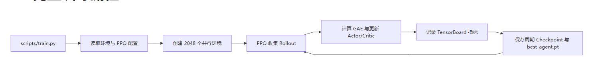
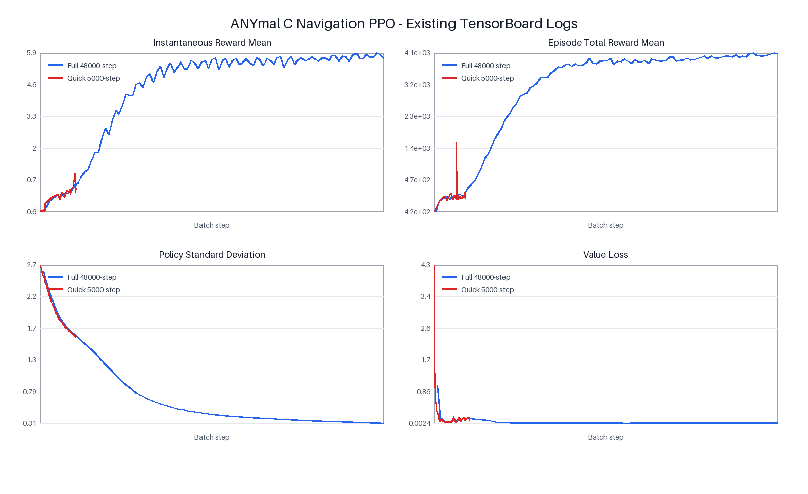

# 第 4 周周报：ANYmal C 完整训练、调试与复现

|项目|内容|
|---|---|
|实验任务|ANYmal C 平地目标导航|
|环境名称|`anymal_c_navigation_flat`|
|强化学习算法|PPO|
|主要训练框架|SKRL \+ Torch|
|并行环境数|2048|
|完整训练长度|48000 batch steps|
|随机种子|42|

## 一、本周工作摘要

本周完成了 ANYmal C 导航任务从物理参数检查、PPO 训练、TensorBoard 指标分析到最佳模型回放的完整流程。

主要成果如下：

1. 核验了机器人的坐标系、关节方向、PD 增益和控制频率。

2. 使用 PPO 完成 48000\-step 完整训练，并保留 TensorBoard 日志与 checkpoint。

3. 对比了完整训练和 5000\-step 快速训练，分析了收敛过程与平台期。

4. 显式加载完整训练的 `best_agent.pt`，完成单环境推理回放并录制视频。

5. 总结了训练与复现过程中发现的问题及后续改进方向。

实验结果表明，完整训练后回合平均奖励由 `-422.224` 提升至 `4012.587`，策略标准差由 `2.604` 降至 `0.309`，Value loss 由 `1.032` 降至 `0.003`。指定最佳 checkpoint 能够正常加载，并在 MotrixRender 中完成推理回放。

## 二、项目与训练链路

### 2\.1 完整训练流程

```Plaintext
flowchart LR
    A[scripts/train.py] --> B[读取环境与 PPO 配置]
    B --> C[创建 2048 个并行环境]
    C --> D[PPO 收集 Rollout]
    D --> E[计算 GAE 与更新 Actor/Critic]
    E --> F[记录 TensorBoard 指标]
    F --> G[保存周期 Checkpoint 与 best_agent.pt]
    G --> D
```



### 2\.2 关键代码文件

|模块|文件|作用|
|---|---|---|
|训练入口|`scripts/train.py`|启动 PPO 训练并选择训练后端|
|推理回放|`scripts/play.py`|加载 checkpoint 并渲染策略行为|
|环境参数|`cfg.py`|定义物理步长、回合时长与控制参数|
|环境逻辑|`anymal_c_np.py`|实现观测、动作、奖励、终止和重置|
|机器人模型|`anymal_c.xml`|定义关节、碰撞体、传感器和执行器|
|PPO 配置|`anymal_navigation.py`|定义 ANYmal C 的 PPO 基线参数|

## 三、物理参数调试

### 3\.1 坐标系与关节方向

ANYmal C 使用浮动 `base` 作为根刚体，具有四条腿和 12 个主动关节。不同腿部的 HFE、KFE 关节轴方向存在符号差异，因此检查默认站姿时，需要同时核对：

- XML 中的 `joint axis`

- 刚体局部姿态 `quat`

- 默认关节角

- 执行器控制方向

当前模型能够正常加载，默认站姿和关节方向与模型结构匹配。

### 3\.2 PD 控制参数

XML 中使用位置执行器控制 12 个主动关节：

|参数|数值|
|---|---|
|比例增益 `Kp`|200|
|阻尼增益 `Kv`|1|
|最大力矩|140 N·m|
|动作缩放|0\.06 rad|

策略输出范围为 `[-1, 1]`。动作经过缩放后叠加到默认站姿关节角，再写入执行器。

较低的 `Kp` 会导致关节跟踪缓慢、机器人姿态偏软；过高的 `Kp` 与不足的阻尼可能引起振荡。当前参数能够支持模型训练与回放。

### 3\.3 控制频率

|参数|数值|
|---|---|
|物理步长 `sim_dt`|0\.01 s|
|控制步长 `ctrl_dt`|0\.01 s|
|每个控制步的物理子步数|1|
|策略决策频率|100 Hz|
|最大回合时间|7 s|
|最大回合步数|700|

MotrixLab 中的物理子步数对应常见强化学习环境中的 `decimation`。当前每个策略动作推进一次物理仿真，控制频率与训练配置一致。

## 四、PPO 基线配置

### 4\.1 网络与算法参数

|参数|配置|
|---|---|
|Actor 隐藏层|`[256, 128, 64]`|
|Critic 隐藏层|`[256, 128, 64]`|
|Rollout 长度|48|
|Learning epochs|6|
|Mini batches|32|
|学习率|`3e-4`|
|折扣因子 Gamma|0\.99|
|GAE Lambda|0\.95|
|Ratio clip|0\.2|
|Value clip|0\.2|
|并行环境数|2048|
|随机种子|42|

### 4\.2 训练规模

完整训练使用 48000 batch steps：

```Plaintext
48000 × 2048 ≈ 98,304,000 次环境状态转移
```

同时保留了 5000\-step 快速训练，用于检查训练链路：

```Plaintext
5000 × 2048 ≈ 10,240,000 次环境状态转移
```

5000\-step 实验适合快速验证代码和日志流程，但不足以代表策略最终收敛效果。

## 五、训练结果与收敛分析

### 5\.1 TensorBoard 训练曲线

下图对比了完整 48000\-step 训练与 5000\-step 快速训练的单步平均奖励、回合平均奖励、策略标准差和 Value loss。



### 5\.2 完整训练关键指标

|训练阶段|单步平均奖励|回合平均奖励|平均回合长度|策略标准差|Value loss|
|---|---|---|---|---|---|
|初期|\-0\.571|\-422\.224|700\.000|2\.604|1\.032|
|约 12000 steps|4\.150|2884\.251|679\.072|0\.848|0\.008|
|约 24000 steps|5\.671|3887\.983|695\.347|0\.438|0\.003|
|48000 steps|5\.670|4012\.587|692\.397|0\.309|0\.003|

### 5\.3 收敛过程分析

**训练前期：** 单步奖励和回合奖励快速上升，表明策略开始学习稳定运动和速度命令跟踪。

**训练中期：** 约 24000 steps 时，单步平均奖励达到约 `5.67`，回合平均奖励接近 `3900`，策略进入高奖励区域。

**训练后期：** 24000 到 48000 steps 之间奖励提升减缓，进入平台期。此时 Value loss 已稳定在约 `0.003`，策略标准差继续下降，说明训练重点由探索逐渐转为动作微调。

**回合长度：** 平均回合长度长期接近最大值 700。该任务成功后不会提前终止，因此较长回合不能直接解释为失败。

### 5\.4 完整训练与快速训练对比

|指标|5000\-step 快速训练|48000\-step 完整训练|
|---|---|---|
|最终单步平均奖励|0\.367|5\.670|
|最终回合平均奖励|\-66\.558|4012\.587|
|最终平均回合长度|334\.951|692\.397|
|最终策略标准差|1\.609|0\.309|
|最终 Value loss|0\.072|0\.003|

完整训练显著优于快速训练。快速训练仍处于探索阶段，策略波动较大；完整训练的奖励、回合稳定性和价值网络拟合均表现更好。

### 5\.5 可重复性

项目中保存了三次 48000\-step 完整训练和三次 5000\-step 快速训练。同类训练的 TensorBoard 首末指标完全一致，说明固定随机种子下训练流程具有较高确定性。

每个训练目录均包含 TensorBoard 事件文件、周期 checkpoint 和 `best_agent.pt`。

## 六、最佳模型推理复现

### 6\.1 回放配置

为避免自动加载最近一次 5000\-step 快速训练权重，本次显式指定完整训练的最佳 checkpoint：

```PowerShell
uv run scripts/play.py `
  --env anymal_c_navigation_flat `
  --rllib skrl `
  --num-envs 1 `
  --seed 42 `
  --policy runs/anymal_c_navigation_flat/skrl/26-04-25_01-00-57-541610_PPO/checkpoints/best_agent.pt
```

### 6\.2 回放结果

|项目|结果|
|---|---|
|Checkpoint|完整 48000\-step 训练的 `best_agent.pt`|
|并行环境数|1|
|随机种子|42|
|渲染器|MotrixRender|
|推理状态|模型成功加载并进入推理回放|
|视频时长|18 秒|
|视频大小|约 21\.93 MiB|

回放视频：

[MotrixRender 2026\-06\-09 15\-21\-55\.mp4](assets/motrixrender-2026-06-09-15-21-55.mp4)


本次回放证明了完整训练 checkpoint 可以被正确加载，并能够进入 MotrixRender 执行运动策略。当前日志尚未直接记录导航成功率、最终目标距离和跌倒率，因此报告不使用单段视频替代任务级定量评估。

## 七、问题与解决过程

### 7\.1 自动回放选择了短训练权重

**问题：** `play.py` 默认从最近的训练目录中选择 `best_agent.pt`。最近运行可能是 5000\-step 快速训练，而不是效果更好的完整训练。

**解决：** 回放时显式传入完整训练的 checkpoint 路径，保证展示模型与训练分析对应。

### 7\.2 奖励提高不能完全代表导航成功

**问题：** 当前 TensorBoard 主要记录奖励、回合长度、策略标准差和损失，缺少导航成功率、目标距离和跌倒率。

**解决思路：** 后续在环境 `info["metrics"]` 中增加：

- `success_rate`

- `distance_to_target`

- `heading_error`

- `time_to_reach`

- `fall_rate`

- `timeout_rate`

### 7\.3 到达阈值不一致

**问题：** `reset()` 使用 `0.1 m` 到达阈值，正常 step 和奖励计算使用 `0.3 m`。

**影响：** 同一物理状态在重置后和正常步进时可能得到不同的到达标志。

**解决思路：** 将到达阈值统一放入配置类，并在观测、奖励和重置过程中共用。

### 7\.4 奖励配置与实际实现脱节

**问题：** `RewardConfig.scales` 已定义，但当前奖励函数仍使用硬编码权重。

**解决思路：** 将奖励拆分为独立命名项，通过配置统一缩放，并在 TensorBoard 中记录各奖励分量。

### 7\.5 噪声配置未接入观测

**问题：** 环境定义了 `NoiseConfig`，但当前观测没有实际加入随机噪声。

**解决思路：** 在训练阶段加入可配置传感器噪声，在评估阶段关闭噪声，并增加确定性测试。

## 八、复现命令

### 8\.1 完整训练

```Bash
uv run scripts/train.py --env anymal_c_navigation_flat --rllib skrl --train-backend torch --seed 42
```

### 8\.2 查看 TensorBoard

```Bash
uv run tensorboard --logdir runs/anymal_c_navigation_flat
```

### 8\.3 回放完整训练最佳模型

```PowerShell
uv run scripts/play.py `
  --env anymal_c_navigation_flat `
  --rllib skrl `
  --num-envs 1 `
  --seed 42 `
  --policy runs/anymal_c_navigation_flat/skrl/26-04-25_01-00-57-541610_PPO/checkpoints/best_agent.pt
```

本报告整理期间未重复启动训练；训练命令保留用于实验复现。最佳模型回放命令已经执行并完成录屏。

## 九、任务完成情况

|第四周要求|完成情况|交付证据|
|---|---|---|
|检查坐标系朝向与 PD 控制增益|已完成|第三节物理参数调试|
|对齐物理步长与控制频率|已完成|`sim_dt=ctrl_dt=0.01 s`，控制频率 100 Hz|
|使用 PPO 完成训练|已完成|48000\-step 完整训练日志与 checkpoint|
|监控 Episode Length、Reward、Policy 等指标|已完成|第五节及 TensorBoard 曲线附件|
|分析收敛趋势与平台期|已完成|第 5\.3 节|
|加载最佳 checkpoint 进行推理|已完成|第六节及 18 秒回放视频|
|提交可独立运行的完整代码|已完成|第 2\.2 节代码文件清单|
|提交训练曲线截图|已完成|`第四周-TensorBoard训练曲线.png`|
|提交运动复现视频|已完成|`第四周-完整训练最佳模型回放-seed42.mp4`|
|总结问题及解决思路|已完成|第七节|

## 十、总结

本周完成了 ANYmal C 导航任务的训练、调试、曲线分析和最佳模型回放闭环。完整 PPO 训练后，回合平均奖励由 `-422.224` 提升至 `4012.587`，策略标准差和 Value loss 明显下降，说明策略从探索逐步转向稳定控制。

完整训练的最佳 checkpoint 已成功加载并完成推理录屏，验证了训练产物与回放链路的可用性。当前工作的主要不足是缺少成功率、目标距离和跌倒率等任务级指标。下一步将补充多随机种子评估与定量导航指标，使模型评价从“奖励收敛、可以回放”进一步提升到“行为效果可量化比较”。
