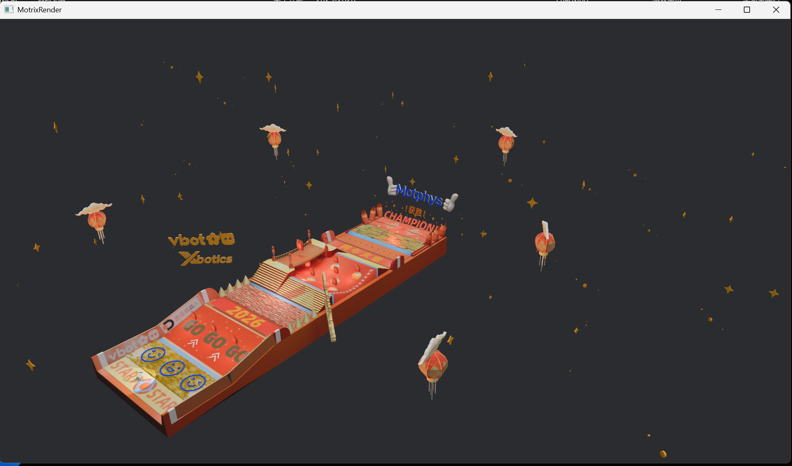
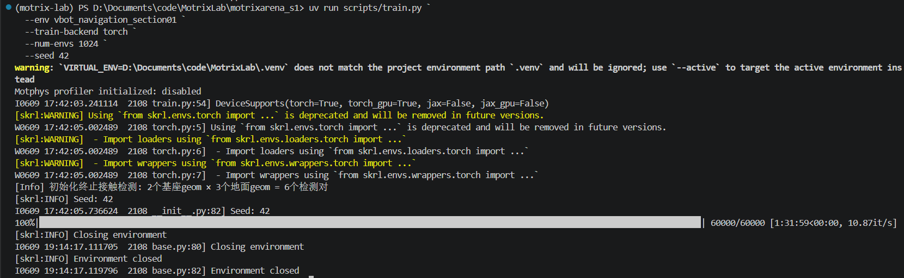

# MotrixArena S1 越障导航 Section1 结营作业

## 一、任务目标

本次实践基于谋先飞官方仓库 `MotrixArena-S1` 版本，完成越障导航赛段第一阶段的环境搭建、资产更新、任务机制修复、训练调试与结果复现。最终目标是使 VBot 机器狗到达 2026 平台，并提交运行录屏。

本次结营作业已完成 Section1 到达任务。

## 二、项目与资产

- 官方项目版本：`MotrixArena-S1`

- 独立开发工作树：`D:\Documents\code\MotrixLab\motrixarena_s1`

- 开发分支：`codex/motrixarena-section1`

- 更新资产：`D:\Documents\code\MotrixLab\vbot_0218.zip`

- 任务环境：`vbot_navigation_section01`

- 机器人：VBot 四足机器人

- 观测维度：54

- 动作维度：12

- 单回合最大步数：4000

- 最终训练目录：`runs/vbot_navigation_section01/26-06-09_20-34-43-384612_PPO`

- 最终权重文件：`runs/vbot_navigation_section01/26-06-09_20-34-43-384612_PPO/checkpoints/best_agent.pt`

- 结果录屏：`D:\Videos\Captures\MotrixRender 2026-06-10 00-05-57.mp4`

为避免影响原仓库中已经完成的 ANYmal\-C 周报实验，本次结营作业在官方 S1 标签上创建了独立工作树。

## 三、资产集成过程

### 3\.1 完成的目录与配置修改

1. 将压缩包内的 VBot 导航资产集成到：

1. `motrix_envs/src/motrix_envs/navigation/vbot`

2. 新增 `navigation/__init__.py`，注册 VBot 导航环境。

3. 修改 `motrix_envs/src/motrix_envs/__init__.py`，加入：

```Python
from . import basic, locomotion, manipulation, navigation  # noqa: F401
```

4. 将资产包内的 PPO 配置集成到 `motrix_rl/src/motrix_rl/cfgs.py`。

5. 将资产包提供的预训练结果放入：

5. `runs/vbot_navigation_section01/26-02-05_13-04-38-452638_PPO`

### 3\.2 README 差异处理

资产包 README 描述的压缩包结构与实际内容存在差异：

- README 中名称为 `vbot_navigation.zip`，实际文件为 `navigation_vbot.zip`。

- 实际压缩包顶层直接为 `vbot`，没有外层 `navigation` 目录。

- 实际压缩包没有 `navigation/anymal_c`，因此未删除官方 `locomotion/anymal_c`，避免破坏官方基线环境。

- 原始 `cfgs.py` 注册了不存在的 `vbot_navigation_section02` 和 `vbot_navigation_section03`，已移除这两项无效配置，保证项目可以正常导入。

## 四、0218 地图资产核验

整体地图入口为：

`motrix_envs/src/motrix_envs/navigation/vbot/xmls/scene_section01.xml`

已确认其中包含：

```XML
<model name="section01V" file="0202_V_section01.xml"/>
<model name="section01C" file="0126_C_section01.xml"/>
<model name="section00V" file="0202_V_section00.xml"/>
```

其中 `0126_C_section01.xml` 是 0218 更新指定的第二赛段第一阶段碰撞模型。



## 五、任务机制修复

资产包中的 `vbot_section01_np.py` 可以加载地图，但原始奖励固定为单元素零数组，终止条件也固定为 `False`，无法用于有效训练。同时，地形碰撞匹配字符串为 `C_`，无法匹配实际的 `C1_`、`C2_`、`C3_` 碰撞体。

本次完成以下修复：

1. 将三个赛段碰撞体前缀配置为 `C1_`、`C2_`、`C3_`。

2. 建立 2 个机器人基座碰撞体与 3 个赛段地形之间的 6 组终止检测对。

3. 增加关节速度越界、NaN/Inf、基座碰撞和侧翻终止条件。

4. 增加目标距离、前进进度、朝向跟踪、速度跟踪和到达奖励。

5. 增加姿态、垂直速度、角速度、力矩、关节速度和动作变化惩罚。

6. 保持原有 54 维观测和 12 维动作不变，以兼容已有策略网络结构。

7. 增加 `distance_to_target`、`reached_target`、`progress` 与 `forward_velocity` 训练指标。

## 六、非训练验证结果

### 6\.1 静态与加载验证

- Python 静态编译：通过

- `vbot_navigation_section01` 注册：通过

- 地图模型加载：通过

- 观测形状：`(2, 54)`

- 碰撞终止检测对：6 组

### 6\.2 短步进验证

使用 2 个环境进行 20 步零动作测试：

- 奖励形状：`(20, 2)`

- 奖励全部为有限数：是

- 奖励范围：约 `-5.50` 至 `-0.22`

- 未出现异常终止

使用 4 个环境进行 500 步随机动作测试：

- 奖励形状：`(500, 4)`

- 奖励全部为有限数：是

- 平均奖励：约 `-1.19`

- 仿真过程无崩溃

人工将关节速度设置为终止阈值以上后，两个测试环境均正确触发终止，说明终止逻辑已生效。

### 6\.3 第一次完整训练与奖励迭代

2026 年 6 月 9 日使用 Windows/Torch、1024 个并行环境完成第一次 60000 步训练，耗时约 1 小时 32 分钟。训练目录为：

`runs/vbot_navigation_section01/26-06-09_17-42-05-794734_PPO`

训练过程正常结束并生成 `best_agent.pt`，但任务指标显示策略没有学会前进：

|指标|训练初期|训练结束|
|---|---|---|
|Instantaneous reward mean|\-1\.8378|1\.1039|
|Total reward mean|\-921\.8107|4018\.4343|
|distance\_to\_target mean|10\.1525 m|9\.9308 m|
|reached\_target max|0|0|

随后使用 `best_agent.pt` 进行 16 个环境、每个环境 4000 步的无窗口验收：

- 成功到达数量：`0/16`

- 平均最小目标距离：约 `9.97 m`

- 最佳目标距离：约 `9.92 m`

该结果说明训练流程已经跑通，但原奖励存在“原地站稳局部最优”：策略可以通过保持姿态和朝向获得持续正奖励，而真实前进带来的收益不足；关节加速度惩罚同时抑制了步态探索。

针对该问题完成第二次奖励迭代：

1. 移除原地站立即可获得的距离与朝向常量正奖励。

2. 将逐步接近目标的进度奖励提升为主要奖励。

3. 增强沿目标方向运动的前进速度奖励。

4. 加入每步时间成本，避免策略长期停留。

5. 移除阻碍早期步态探索的关节加速度惩罚。

6. 将首次到达奖励提高至 100。

修复后验证结果：

- 零动作平均奖励：约 `-0.72`

- 随机动作平均奖励：约 `-0.38`

- 奖励全部为有限数

- 6 组碰撞终止检测保持正常

因此第一次训练权重仅作为问题分析证据，不作为最终到达平台的验收权重。


### 6\.4 第二次完整训练与无窗口验收

根据奖励迭代结果重新训练，训练目录为：

`runs/vbot_navigation_section01/26-06-09_20-34-43-384612_PPO`

本次训练生成的最终验收权重为：

`runs/vbot_navigation_section01/26-06-09_20-34-43-384612_PPO/checkpoints/best_agent.pt`

训练指标相比第一次训练明显改善：

|指标|训练初期|训练结束|最优/峰值|
|---|---|---|---|
|Instantaneous reward mean|\-0\.5819|3\.2531|3\.6043|
|Total reward mean|\-298\.8233|12097\.1270|12622\.3652|
|distance\_to\_target mean|9\.8585 m|1\.1508 m|0\.8892 m|
|distance\_to\_target min|8\.4878 m|0\.0017 m|0\.0001 m|
|reached\_target mean|0|0\.7048|0\.8268|
|reached\_target max|0|1|1|

随后使用 `best_agent.pt` 进行 16 个环境、每个环境 4000 步的无窗口验收，结果如下：

- 成功到达数量：`16/16`

- 首次到达步数范围：约 `461` 至 `766` 步

- 平均最小目标距离：约 `0.125 m`

- 最佳最小目标距离：约 `0.0146 m`

- 最差最小目标距离：约 `0.2344 m`

到达阈值为 `0.3 m`，因此无窗口验收已经满足 Section1 到达目标要求。随后使用同一权重进行可视化播放，并录制机器人到达 2026 平台的视频。




### 6\.5 训练图表数据

以下数据来自第二次训练的 TensorBoard 日志，可用于绘制训练曲线图。

**奖励曲线数据**

|Step|Instantaneous reward mean|Total reward mean|
|---|---|---|
|1000|\-0\.5819|\-298\.8233|
|10000|0\.2782|597\.1039|
|20000|2\.4594|6867\.2847|
|30000|3\.2862|11483\.1572|
|40000|3\.5352|11770\.9180|
|47000|3\.2531|12097\.1270|

**目标距离曲线数据**

|Step|distance\_to\_target mean \(m\)|distance\_to\_target min \(m\)|
|---|---|---|
|1000|9\.8585|8\.4878|
|10000|4\.7416|2\.7207|
|20000|1\.1882|0\.0004|
|30000|1\.0733|0\.0003|
|40000|0\.9998|0\.0005|
|47000|1\.1508|0\.0017|

**导航进度与到达率曲线数据**

|Step|progress mean|forward\_velocity mean|reached\_target mean|reached\_target max|
|---|---|---|---|---|
|1000|0\.0016|0\.1642|0\.0000|0|
|10000|0\.0024|0\.2393|0\.0000|0|
|20000|0\.0024|0\.2423|0\.6102|1|
|30000|0\.0028|0\.2755|0\.7314|1|
|40000|0\.0025|0\.2504|0\.7983|1|
|47000|0\.0030|0\.3025|0\.7048|1|

从图表数据可以看到，第二次训练后目标距离从约 `9.86 m` 降至约 `1.15 m`，到达率峰值达到约 `0.83`，并在无窗口验收中达到 `16/16`。

## 七、已有预训练资产说明

压缩包提供了 JAX 格式的预训练权重：

`runs/vbot_navigation_section01/26-02-05_13-04-38-452638_PPO/checkpoints/best_agent.pickle`

事件日志最后记录于第 15000 步，主要指标如下：

|指标|最后记录值|
|---|---|
|Instantaneous reward mean|7\.0956|
|Total reward mean|8210\.8936|
|Total reward max|16250\.9795|
|Policy loss|\-0\.000944|
|Value loss|0\.012376|

上述数据来自资产包提供的历史训练日志，不作为本人最终到达 2026 平台的录屏证明。

## 八、关键运行命令

以下命令均在 `D:\Documents\code\MotrixLab\motrixarena_s1` 下执行。

### 8\.1 安装 Windows/Torch 运行依赖

```PowerShell
uv sync --package motrix-rl --extra skrl-torch
```

### 8\.2 可视化检查

```PowerShell
uv run scripts/view.py --env vbot_navigation_section01 --num-envs 1
```

### 8\.3 Windows 使用 Torch 训练

当前 Windows 环境支持 Torch，不支持项目限定的 Linux/JAX 依赖。本次最终训练命令为：

```PowerShell
uv run scripts/train.py `
  --env vbot_navigation_section01 `
  --train-backend torch `
  --num-envs 1024 `
  --seed 42
```

训练结束后生成的有效训练目录为：

`runs/vbot_navigation_section01/26-06-09_20-34-43-384612_PPO`

### 8\.4 播放本人训练的 Torch 权重

```PowerShell
uv run scripts/play.py `
  --env vbot_navigation_section01 `
  --num-envs 1 `
  --seed 42 `
  --policy runs/vbot_navigation_section01/26-06-09_20-34-43-384612_PPO/checkpoints/best_agent.pt
```


### 8\.5 Linux 使用资产包自带 JAX 权重

首次运行前安装 Linux/JAX 后端：

```Bash
uv sync --package motrix-rl --extra skrl-jax
```

```Bash
uv run scripts/play.py \
  --env vbot_navigation_section01 \
  --num-envs 1 \
  --seed 42 \
  --policy runs/vbot_navigation_section01/26-02-05_13-04-38-452638_PPO/checkpoints/best_agent.pickle
```

## 九、问题与解决方式

|问题|原因|解决方式|
|---|---|---|
|项目主分支与作业要求不一致|作业要求官方 `MotrixArena-S1` 标签|创建独立 S1 工作树|
|README 与压缩包目录不一致|资产包实际结构发生变化|按实际目录集成并逐项核验|
|导入 `motrix_rl` 失败|PPO 配置注册了不存在的环境|移除无效 section02/03 配置|
|找不到终止碰撞体|`C_` 无法匹配 `C1_`、`C2_`、`C3_`|按三个赛段前缀匹配|
|奖励和终止逻辑失效|资产包源码中被固定为零和 False|补全奖励与终止机制|
|第一次训练奖励上涨但机器人不前进|原地站稳可持续获得正奖励，进度奖励偏弱|根据到达率和距离曲线重构导航奖励|
|可视化播放出现 `wgpu Out of Memory`|场景阴影贴图为 8192，且性能渲染设置中仍强制开启阴影|关闭渲染阴影并降低 Section1 场景阴影尺寸|
|Windows 无法播放自带 `.pickle`|S1 项目仅在 Linux 安装 JAX 依赖|Windows 使用 Torch 训练并播放 `.pt`；自带权重在 Linux 播放|

## 十、最终结果

目前已经完成官方 S1 环境搭建、0218 地图资产集成、Section1 环境注册、奖励与终止机制修复、两轮训练调试、无窗口策略验收与可视化录屏。

最终结果如下：

- 最终权重：`runs/vbot_navigation_section01/26-06-09_20-34-43-384612_PPO/checkpoints/best_agent.pt`

- 无窗口验收成功率：`16/16`

- 平均最小目标距离：约 `0.125 m`

- 最差最小目标距离：约 `0.2344 m`

- 到达阈值：`0.3 m`

- 可视化录屏：`D:\Videos\Captures\MotrixRender 2026-06-10 00-05-57.mp4`

> 视频证据 5/6：最终结果展示视频为 `D:\Videos\Captures\MotrixRender 2026-06-10 00-05-57.mp4`

本次结营作业完成了 MotrixArena S1 越障导航 Section1 阶段，机器人能够到达 2026 平台，满足本次结营作业“完成越障导航赛段第一阶段”的要求。


[MotrixRender 2026\-06\-10 00\-05\-57\.mp4](assets/motrixrender-2026-06-10-00-05-57.mp4)


## 十一、提交清单

- 作业说明文档：`D:\Documents\code\MotrixLab\task\结营作业-MotrixArena-S1越障导航Section1.md`

- 运行结果录屏：`D:\Videos\Captures\MotrixRender 2026-06-10 00-05-57.mp4`

- 最终训练目录：`D:\Documents\code\MotrixLab\motrixarena_s1\runs\vbot_navigation_section01\26-06-09_20-34-43-384612_PPO`

- 最终策略权重：`D:\Documents\code\MotrixLab\motrixarena_s1\runs\vbot_navigation_section01\26-06-09_20-34-43-384612_PPO\checkpoints\best_agent.pt`
