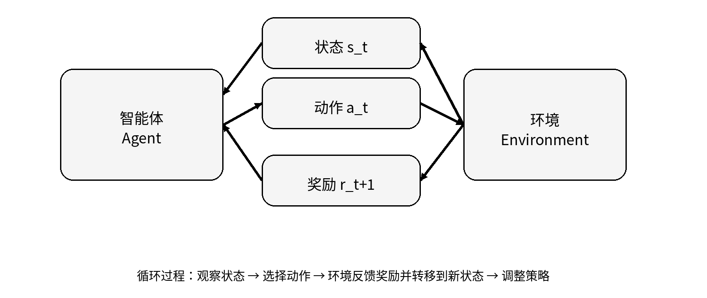
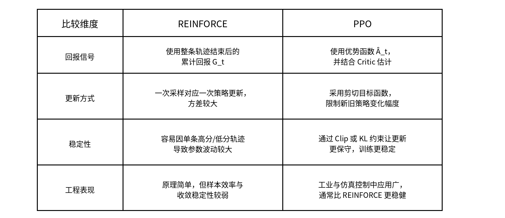
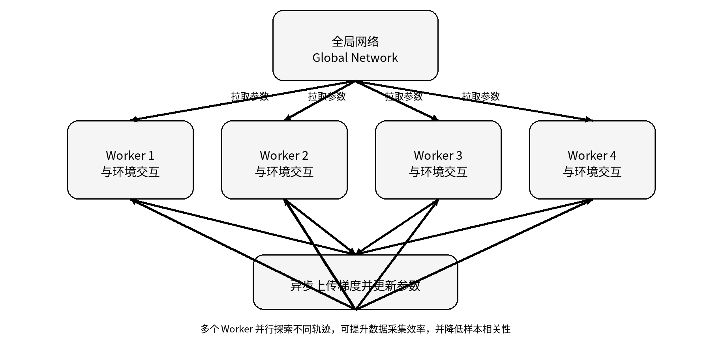

## 一、学习内容

本周主要学习了深度强化学习的基础概念与典型算法，对强化学习从基本框架到工程落地的整体逻辑有了更系统的认识。通过本周学习，我逐步理解了强化学习是让智能体在与环境不断交互的过程中，通过试错学习出更优策略。强化学习的核心闭环是：智能体先观察环境状态，再执行动作，环境根据动作返回奖励并转移到新的状态，智能体再依据这些反馈持续调整策略，最终目标是在长期交互中获得尽可能大的累积奖励。

从图 1 可以看出，强化学习的关键在于“状态—动作—奖励—新状态”的持续循环。

在基本理论方面，本周重点学习了马尔可夫决策过程，也就是强化学习最核心的统一建模框架。一个标准的 MDP 可以表示为：
$$
(S, A, P, R, \gamma)
$$
其中，**S**表示状态空间，**A** 表示动作空间，**P**表示状态转移概率，**R** 表示奖励函数， **γ**表示折扣因子。这个五元组描述了智能体所处环境的核心结构。通过这一框架，我进一步理解了为什么强化学习关注的是“长期累计收益”，而不是只看眼前的一次即时奖励。

### 价值函数部分

我重点理解了 Q 值和 V 值的区别。V 值用于衡量一个状态本身的长期价值，Q 值则用于衡量在某个状态下采取某个动作后的长期收益。简单说，V 值是在问“这个局面整体值不值得待下去”，Q 值是在问“在这个局面下做这个动作值不值得”。

### 价值估计方法

我学习了蒙特卡洛方法、贝尔曼思想和时序差分方法。蒙特卡洛方法依赖完整回合结束后的总回报来估计价值，优点是概念直观，但必须等到整条轨迹结束后才能更新，因此方差较大。时序差分方法则能够在每一步交互后，利用当前奖励和下一状态的价值估计来更新当前价值，因此效率更高，也更适合在线学习。贝尔曼公式则从递归角度刻画了当前价值与未来价值之间的关系，是强化学习后续所有算法的重要理论基础。

### 具体算法部分

我首先学习了基于价值函数的方法，包括 Q-learning 和 DQN。Q-learning 使用 Q-table 记录状态—动作对的价值，适合状态空间和动作空间都比较小的离散问题；但一旦状态维度很高，例如图像、连续观测或复杂机器人状态，Q-table 就会迅速膨胀，不再具有实际可用性。DQN 在这一基础上引入深度神经网络，用网络来逼近 Q 值函数，从而解决了传统查表法在高维状态空间下的存储和泛化问题。同时，DQN 还结合了经验回放和目标网络两大关键机制，以减轻训练不稳定问题。这部分让我理解了深度强化学习为什么是“强化学习 + 深度学习”的自然结合，而不是两者的简单叠加。

### 策略梯度部分

我重点学习了 REINFORCE 和 Actor-Critic 架构。REINFORCE 的思路是直接优化策略本身，而不是先学价值再导出动作，因此它在连续动作空间中具有天然优势。但它的一个明显问题在于，必须等到完整回合结束后，才能用整条轨迹的累计回报来更新策略，这会带来较大的方差和训练不稳定性。Actor-Critic 则通过引入 Critic 网络来估计价值或优势函数，从而为 Actor 的策略更新提供更稳定的指导信号。与纯 REINFORCE 相比，Actor-Critic 在效率和稳定性之间取得了更好的平衡，也因此成为后续很多强化学习算法的基础架构。

### PPO算法

本周还重点学习了 PPO 和 A3C 两个更具实际应用价值的算法。PPO 是当前非常常用的策略优化算法，它在 Actor-Critic 基础上，通过限制策略更新幅度，使训练过程更加稳健。PPO 的核心思想可以简化理解为：允许策略更新，但不允许一次更新得太激进。其典型裁剪目标可写为：
$$
L^{clip}(\theta)=\min \left(r_t(\theta)\hat{A}_t,\; \text{clip}(r_t(\theta),1-\epsilon,1+\epsilon)\hat{A}_t \right)
$$
这个公式的关键不在于记住符号，而在于理解：PPO 通过 clip 机制限制新旧策略差异过大，避免策略一次更新“冲过头”，从而显著提高训练稳定性。

图 2 直观反映了两者的差别：REINFORCE 更依赖完整轨迹回报，更新噪声较大；PPO 则在 Actor-Critic 基础上加入了裁剪或约束机制，使策略更新更保守、更稳定，因此在实际工程中更容易收敛，也更常被采用。

### A3C算法

A3C 则是另一条非常典型的改进思路。它采用“一主多从”的异步并行架构，由多个 worker 同时在不同环境中与环境交互，并将各自计算得到的梯度异步上传到全局网络。这样做的好处有两个：一是显著加快数据获取速度，二是由于多个 worker 同时探索不同轨迹，能够天然降低样本之间的时间相关性，提高训练效率和稳定性。

图 3 展示了 A3C 的核心结构：全局网络负责整合梯度并更新参数，多个 worker 则各自在独立环境中并行采样、计算梯度并异步上传。相比单线程训练，这种方式能更好地利用多核 CPU 资源，也更符合强化学习“样本来之不易”的现实问题。

最后，本周内容还延伸到了强化学习与深度学习结合后的实际落地逻辑。例如，在机器人控制中，强化学习可以通过仿真环境进行大规模试错训练；在大语言模型中，强化学习则进一步体现在 RLHF 等对齐方法中，用于让模型输出更加符合人类偏好。通过这一部分学习，我认识到强化学习并不只是课堂里的抽象理论，它已经成为机器人、自动驾驶、大模型等现代人工智能系统中的重要方法。

## 二、作业问题回答

### 1. 强化学习的根本目标是什么？

强化学习的根本目标，是让智能体在与环境持续交互的过程中，通过不断试错学习出一套更优策略，从而使长期累积奖励尽可能大。它关注的不是某一步的即时收益，而是从当前状态开始，经过一系列动作之后，整体上能够取得多大的长期回报。

### 2. DQN 和 Q-learning 的核心区别是什么？

DQN 和 Q-learning 的核心区别，在于它们表示和学习 Q 值的方式不同。

Q-learning 是经典的表格型强化学习方法，使用 Q-table 来记录每个状态—动作对对应的 Q 值。这种方法在状态空间较小、动作空间有限的离散任务中是有效的，但当状态维度很高时，比如图像输入、复杂机器人状态或者连续观测，Q-table 会迅速变得无法存储，也没有泛化能力。

DQN 则引入了深度神经网络，用网络来逼近 Q 值函数。也就是说，它不再显式维护一张巨大的 Q 表，而是输入当前状态，由神经网络直接输出各个动作的 Q 值。这使得 DQN 能够处理更高维、更复杂的状态空间。

此外，DQN 还引入了经验回放和目标网络等机制，以提高训练稳定性。经验回放通过打乱数据顺序来减小样本相关性，目标网络则通过延迟更新目标值来减轻训练震荡。因此，DQN 可以看作是 Q-learning 在深度学习条件下的重要扩展。

### 3. 为什么 PPO 在实际应用中比 REINFORCE 更稳定？

PPO 比 REINFORCE 更稳定，主要原因在于它通过 Actor-Critic 架构和裁剪机制，同时解决了方差大和策略更新过猛这两个问题。

REINFORCE 属于最基础的策略梯度算法，它直接用完整轨迹的累计回报来更新策略。这个方法原理简单，但问题也很明显：它必须等整局结束才能更新，而且整条轨迹的随机性会直接影响梯度方向，因此方差很大，训练过程往往波动明显。

PPO 则是在 Actor-Critic 框架基础上的改进算法。Critic 网络会先评估当前状态或动作的价值，为 Actor 提供更稳定的更新信号，从而降低方差。更关键的是，PPO 在策略更新时加入了裁剪或约束机制，限制新策略偏离旧策略过大，避免单次更新过于激进。这样一来，策略虽然在持续优化，但每一步都被控制在较安全的范围内，因此训练过程会更加平稳。

### 4. A3C 算法的主要优势是什么？

A3C 算法的主要优势，在于它通过多个 worker 并行与环境交互，并异步更新全局网络，从而显著提高了数据采集效率和训练速度。

强化学习的一大难点，就是样本必须靠智能体与环境交互获得，而不像监督学习那样可以直接拿到大量标注数据。A3C 通过多个 worker 同时在不同环境中探索，把原本单线程的采样过程并行化，大大加快了经验获取速度。

同时，由于多个 worker 走的是不同轨迹，它们产生的数据天然更加多样化，可以降低样本之间的时间相关性，改善训练稳定性。再加上异步更新机制不需要等待所有 worker 同步完成，计算资源利用率更高，因此 A3C 在多核 CPU 环境下尤其有效。

因此，A3C 的核心优势可以概括为：并行采样提高效率，异步更新加快训练，多 worker 机制减弱数据相关性，并且能够更充分地利用硬件资源。

## 三、总结

通过本周的学习，我对强化学习的发展脉络有了更加清晰的认识。最开始是智能体与环境交互的基本框架，然后是 MDP、价值函数和贝尔曼公式等理论基础，再进一步发展到 Q-learning、DQN 这样的价值函数方法，以及 REINFORCE、Actor-Critic、PPO、A3C 等策略优化方法。把这些算法放到同一条逻辑线上去理解之后，会发现它们并不是彼此孤立的知识点，而是在不断解决前一代方法中存在的问题。

我觉得本周最重要的收获有三点。第一，我真正理解了强化学习为什么强调“长期回报”，而不是只看眼前一步。第二，我能较清楚地区分基于价值的方法和基于策略的方法，以及它们各自的适用场景。第三，我对“为什么现代强化学习要越来越强调训练稳定性、样本效率和并行采样”有了更直观的认识。很多看上去复杂的算法改进，其实本质上都是围绕这些问题展开的。
