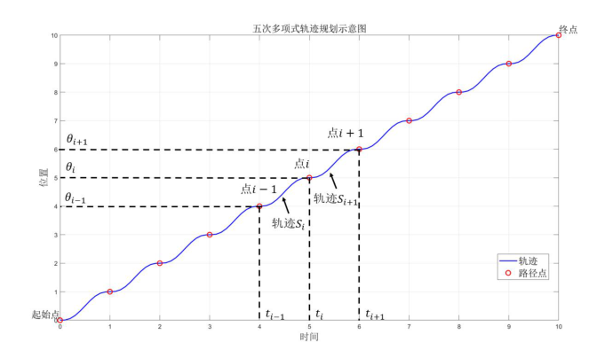
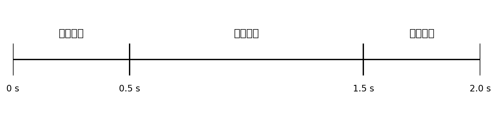

## 一、学习内容

本周主要学习了机器人轨迹规划的相关内容，围绕机器人如何从起点运动到终点、如何生成合理路径以及如何保证运动过程平稳可控进行了系统了解。通过本周学习，我认识到轨迹规划要在满足任务要求的前提下，为机器人设计一条连续、平滑、可执行且满足约束的运动过程。学习文档中指出，机器人轨迹包含位移、速度和加速度的时间序列，因此轨迹规划不仅要考虑路径本身，还要考虑时间安排和动力学约束。

### （1）基础插值方法

在基础插值方法部分，我主要学习了直线插值和多项式插值的基本思想。

- 直线插值比较直观，适合描述两个状态之间的简单过渡；
- 多项式插值则能够让轨迹在位置、速度甚至加速度上更加平滑。

学习文档介绍了三次多项式和五次多项式两种典型方法：
- 三次多项式轨迹规划能够保证位置和速度的连续变化，适合对轨迹平滑性有一定要求但不特别强调加速度约束的场景；
- 五次多项式则进一步考虑了加速度连续性，因此生成的轨迹更加平滑，能够有效减少机械冲击，更适合精密机械臂或对运动品质要求更高的任务。

以五次多项式轨迹规划为例，其关节轨迹可表示为：
$$
\
\theta(t)=a_0+a_1 t+a_2 t^2+a_3 t^3+a_4 t^4+a_5 t^5
$$
其中，
$$
\theta(t)
$$
表示关节在时刻 t 的位置，
$$
a_0 \sim a_5
$$
为待定系数。相比三次多项式，五次多项式不仅能够描述位置和速度变化，还能进一步控制加速度连续性，因此更适合对运动平滑性和机械冲击控制要求较高的任务。

**图 1 五次多项式曲线规划示意图**

从图 1 可以看出，轨迹规划不仅要保证起点和终点的连通，还要关注中间路径点处的连续性与平滑性。对于多段轨迹来说，位置、速度和加速度的连续变化是保证运动质量的重要前提。

### （2）笛卡尔空间轨迹与关节空间轨迹

在轨迹规划空间表示部分，我重点学习了关节空间轨迹规划和笛卡尔空间轨迹规划的区别。

关节空间轨迹规划是直接对各个关节变量进行规划，只需考虑各关节角度或位移如何从起始状态变化到目标状态，计算相对简单，也能有效降低逆运动学求解次数，因此适合多数基础运动控制场景。学习资料中提到，这种方法只需要对起点和终点进行逆解，计算复杂度较低，但由于不直接控制末端执行器在空间中的具体路径，因此中间轨迹不够直观，也可能带来碰撞或路径不可控的问题。

笛卡尔空间轨迹规划则更关注末端执行器在实际任务空间中的位置和姿态变化。它能够更加精确地控制末端执行器按指定路径运动，例如焊接、喷涂、装配等任务就更适合使用这种规划方式。但由于笛卡尔空间轨迹规划通常需要对轨迹上的多个点进行逆运动学求解，因此计算量更大，也可能遇到奇异位形等问题。

总体来说，关节空间规划更适合“快速、简洁地让机器人到达目标”的任务，而笛卡尔空间规划更适合“必须严格控制末端路径形状”的任务。不同规划方式的选择，和具体任务需求密切相关。

### （3）轨迹的时间参数化与速度/加速度约束

在时间参数化部分，我理解了路径和轨迹的区别。路径更像是一组空间位置点的集合，而轨迹则是在路径的基础上加入了时间、速度和加速度等属性，使机器人在每一个时刻的运动状态都被明确描述。路径规划通常先给出一组从起点到终点的路径点，但如果这些路径点没有进一步进行速度和加速度约束，机器人在执行时可能会产生较大冲击，甚至超过电机和驱动系统的能力范围。

因此，速度和加速度约束的作用非常关键。一方面，它可以防止机器人运动过快、过猛，减小机械冲击与振动；另一方面，也可以保证控制过程稳定，避免电机过载、轨迹跟踪误差过大等问题。轨迹规划必须结合动力学约束，避免过快或过大的运动对机器人造成损伤，或者导致控制精度下降。

### （4）基本路径规划算法：RRT 和 PRM

在基本路径规划算法部分，我初步了解了 RRT 和 PRM 两类常见方法。
- RRT 属于基于随机采样逐步扩展的规划思路，它会从起点出发不断向随机采样点方向扩展树结构，快速探索可行空间，适合复杂环境下的单次查询任务。
- PRM 则更强调先在已知环境中建立一张覆盖自由空间的路线图，之后再将起点和终点接入图中进行搜索，因此更适合静态环境和多次重复查询的场景。学习资料对两者的建图逻辑和适用场景都做了说明。

通过这一部分学习，我认识到轨迹规划可以分成两个层面：一个层面是“找到一条可行路径”，另一个层面是“让机器人沿着这条路径平滑运行”。RRT、PRM 更多解决的是前者，而插值、多项式规划和时间参数化则更多解决后者。这个理解对后续学习 MoveIt、导航仿真和机器人控制都很有帮助。

## 二、作业

### 1. 轨迹规划时，为什么要限制速度和加速度？

轨迹规划中限制速度和加速度，主要是为了保证机器人运动过程的安全性、平稳性和可执行性。机器人各个关节通常由电机、减速器和驱动器共同完成控制，而这些执行部件本身都存在明确的物理极限，例如最大转速、最大扭矩和最大允许负载。

此外，限制速度和加速度也是为了提高控制精度和运动平稳性。若机器人在起步时突然高速运动，或在终点前突然急停，就容易产生振动、抖动和超调现象，不仅影响末端执行器的定位精度，还可能使工件偏移、装配失败，甚至在高速情况下发生碰撞。

从系统安全角度来看，速度和加速度约束也是必不可少的。在有人机协作、上下料、避障和动态环境任务中，如果机器人动作过快，风险会明显增加。合理的速度和加速度限制可以有效降低高速碰撞风险，保障人员、工件和机器人本体安全。也正因为如此，轨迹规划中的约束并不是“让机器人慢下来”这么简单，而是在效率、精度、寿命和安全之间寻找平衡。只有满足这些约束的轨迹，才是真正可用的工程轨迹。

### 2. 如果规定两秒钟必须完成一次动作，应该如何合理安排轨迹？

如果规定两秒钟内必须完成一次动作，那么本质上就是在固定总时间条件下，对整条运动轨迹进行时间参数化设计。也就是说，先确定起点和终点，再把总时长 2 秒分配到整个运动过程中，使机器人在规定时间内平稳地完成动作。参考文档中将这一过程概括为“固定总时长下的时间参数化映射”，即需要建立路径参数与真实时间之间的关系，使机器人在 2 秒内完成从起点到终点的连续运动。

若将轨迹执行进度记为 s(t)，则其时间约束可以写为：
$$
s(0)=0,\quad s(2)=1
$$
这表示机器人在 0 秒时位于起点，在 2 秒时到达终点。为了保证轨迹平滑，通常不会采用突然启动和突然停止的方式，而是将整个过程划分为平滑加速、稳定运行和平滑减速三个阶段。

**图 2 两秒动作时间分配示意图**

从图 2 可以看出，在总时长固定为 2 秒的情况下，可以将时间大致分成三个部分：开始阶段逐步加速，中间阶段保持较稳定速度，末尾阶段再逐步减速。这种方式比“全程匀速”或“最后急停”更合理，也更符合机器人执行器的实际能力。参考文档中也普遍提到梯形速度曲线、S 型速度曲线或五次多项式时间分配，用来实现这种平滑过渡。

在具体安排上，通常应采用平滑插值方法来设计轨迹，例如三次多项式、五次多项式、梯形速度曲线或 S 型速度曲线。如果只要求位置和速度较为平滑，三次多项式已经可以满足基本要求；如果还希望加速度更加连续、减少机械冲击，那么五次多项式或 S 型速度曲线会更加合适。

不过，2 秒完成动作并不意味着任何轨迹都能被强行压缩到 2 秒。规划完成后，还必须校验轨迹在这 2 秒内对应的峰值速度和峰值加速度是否超出机器人本身的能力范围。也就是说，合理安排两秒轨迹，不是简单平均分时间，而是在总时间固定的前提下，通过合适的轨迹模型和约束校验，设计出一条既满足节拍又真实可执行的轨迹。

## 三、总结

通过本周的学习，我对轨迹规划有了比之前更系统的认识。首先，我明白了路径和轨迹并不是同一个概念，路径更强调空间上的连通，而轨迹则进一步加入了时间、速度和加速度等动态属性。其次，我理解了关节空间轨迹规划和笛卡尔空间轨迹规划各有特点，前者更适合快速平稳到达目标，后者更适合精确控制末端路径。最后，我也认识到速度和加速度约束在轨迹规划中不是附属条件，而是保证轨迹真正可执行、可控制、可落地的关键。
